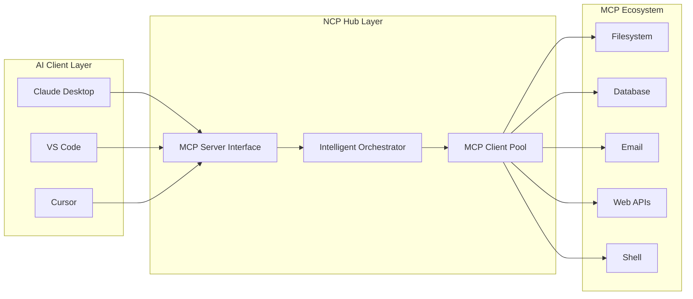
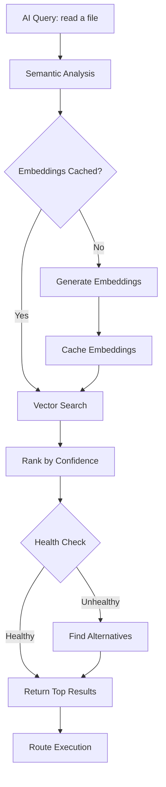
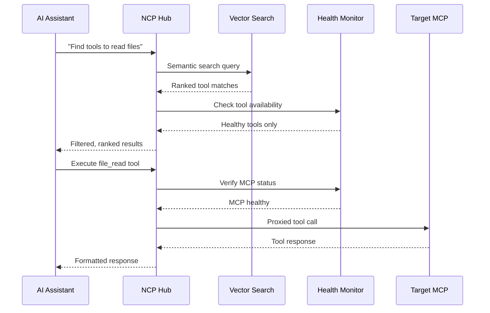

# NCP Technical Deep Dive

> **For overview and setup:** See the [README](README.md)
> **This guide covers:** Architecture, algorithms, and implementation details

## Core Architecture

### Dual Role Design: Server + Client

NCP operates as both an **MCP server** (to your AI client) and an **MCP client** (to downstream MCPs):



## Semantic Discovery Engine

### Vector Similarity Algorithm

NCP uses **@xenova/transformers** for semantic matching between queries and tool capabilities:

```typescript
interface DiscoveryResult {
  tool: string;
  mcp: string;
  confidence: number;
  description: string;
  schema: ToolSchema;
}

interface ToolEmbedding {
  tool: string;
  mcp: string;
  vector: number[];
  description: string;
  keywords: string[];
}
```

### Search Process Flow



### Why Vector Embeddings Work

1. **Semantic Understanding**: "read a file" matches `file_read`, `get_content`, `load_document`
2. **Intent Recognition**: "send email" finds email tools even if query doesn't contain exact keywords
3. **Confidence Scoring**: Ranks tools by relevance (0-1 scale) for best matches first
4. **Cache Efficiency**: Embeddings computed once, reused for instant searches

## Health Monitoring System

### Real-Time Health Tracking

```typescript
interface HealthStatus {
  status: 'healthy' | 'degraded' | 'unhealthy';
  latency: number;
  successRate: number;
  lastCheck: Date;
  alternatives?: string[];
}
```

### Monitoring Strategy
- **Continuous Polling**: Background health checks every 30 seconds
- **Automatic Blacklisting**: Remove unhealthy servers from routing
- **Recovery Detection**: Automatically re-enable recovered servers
- **Graceful Degradation**: Find alternatives when primary tools fail

## Tool Execution Flow



## Connection Pool Management

### Efficient Resource Handling
- **Lazy Loading**: MCPs only loaded when needed
- **Resource Cleanup**: Automatic connection management
- **Memory Optimization**: Efficient use of system resources
- **Concurrent Execution**: Parallel tool execution when possible

### Process Isolation
Each MCP runs in a separate process for:
- **Security**: Isolated credential spaces
- **Stability**: One MCP failure doesn't affect others
- **Resource Control**: Memory and CPU limits per MCP

## Performance Characteristics

### Latency Optimization
- **Cold Start**: First semantic search ~200ms (embedding generation)
- **Warm Cache**: Subsequent searches ~10-50ms (vector lookup only)
- **Tool Execution**: Direct proxy with minimal overhead

### Memory Usage
- **Embedding Cache**: ~50KB per 100 tools
- **Connection Pool**: ~10MB per active MCP
- **Total Overhead**: <100MB for typical 50-MCP setup

### Scalability Limits
- **Tested**: Up to 100 MCP servers simultaneously
- **Theoretical**: 1000+ servers (limited by system resources)
- **Network**: Minimal bandwidth usage through smart caching

## Profile System Implementation

### Configuration Structure
```json
{
  "profiles": {
    "development": {
      "stripe": {
        "command": "npx stripe-cli",
        "env": { "API_KEY": "sk_test_..." }
      },
      "database": {
        "command": "npx db-server",
        "args": ["--host", "localhost"]
      }
    },
    "production": {
      "stripe": {
        "command": "npx stripe-cli",
        "env": { "API_KEY": "sk_live_..." }
      },
      "database": {
        "command": "npx db-server",
        "args": ["--host", "prod.db.com"]
      }
    }
  }
}
```

### Profile Resolution
1. **Project-local**: `.ncp/profiles/` directory in current project
2. **Global fallback**: `~/.ncp/profiles/` in user home directory
3. **Environment override**: `NCP_PROFILE` environment variable

## Error Handling & Recovery

### Failure Categories
- **Transient**: Network timeouts, temporary unavailability
- **Permanent**: MCP server crashes, configuration errors
- **Partial**: Some tools work, others fail

### Recovery Strategies
- **Automatic Retry**: 3 attempts with exponential backoff
- **Alternative Routing**: Backup tools suggested when primary fails
- **Graceful Degradation**: Partial failures don't break workflow
- **User Notification**: Clear error messages with actionable advice

## Security Model

### Credential Isolation
- **Environment Separation**: Different API keys per profile
- **No Persistence**: Credentials passed through, never stored
- **Process Boundaries**: Each MCP isolated from others

### Network Security
- **Local Only**: All MCP communication over localhost/stdio
- **No External Calls**: NCP doesn't make outbound network requests
- **Process Sandboxing**: MCPs can't access each other's resources

### Audit & Logging
- **Request Logging**: Optional detailed request/response logs
- **Health Metrics**: Performance and availability tracking
- **Error Reporting**: Structured error logs with context

## Advanced Configuration

### High-Availability Patterns
```bash
# Redundant MCP setups for critical tools
ncp add filesystem-primary npx @modelcontextprotocol/server-filesystem ~/primary
ncp add filesystem-backup npx @modelcontextprotocol/server-filesystem ~/backup

# Load balancing configuration
ncp config set load_balancing.strategy "round_robin"
ncp config set load_balancing.health_check_interval 30000
```

### Performance Tuning
```bash
# Adjust cache sizes
ncp config set cache.embeddings.max_size 10000
ncp config set cache.health.ttl 60000

# Connection pool tuning
ncp config set pool.max_connections 100
ncp config set pool.idle_timeout 300000
```

## Debugging & Monitoring

### Debug Mode
```bash
# Enable detailed logging
DEBUG=ncp:* ncp find "file tools"
DEBUG=ncp:health ncp list --depth 1
DEBUG=ncp:discovery ncp run filesystem:read_file
```

### Performance Monitoring
```bash
# Health status overview
ncp list --depth 1                    # See all MCP health
ncp config validate                    # Validate configuration
ncp health --detailed                  # Detailed health report

# Cache statistics
ncp stats --cache                      # Embedding cache performance
ncp stats --health                     # Health check statistics
```

## Implementation Notes

### Technology Stack
- **Runtime**: Node.js 18+ with ES modules
- **AI Models**: @xenova/transformers for embeddings
- **Protocol**: JSON-RPC 2.0 over stdio/SSE
- **Storage**: File-based configuration, in-memory caching

### Key Dependencies
```json
{
  "@xenova/transformers": "^2.6.0",    // Vector embeddings
  "citty": "^0.1.3",                   // CLI framework
  "consola": "^3.2.3",                 // Logging
  "ofetch": "^1.3.3"                   // HTTP client
}
```

### Development Philosophy
1. **Simplicity**: Complex orchestration behind simple interface
2. **Performance**: Sub-second response times required
3. **Reliability**: Graceful handling of any MCP failure
4. **Scalability**: Linear scaling to 100+ MCPs
5. **Compatibility**: Full MCP protocol compliance

---

**The Result**: Your AI experiences a clean, fast interface while NCP handles all the complexity of managing multiple MCP servers, health monitoring, semantic routing, and error recovery behind the scenes.