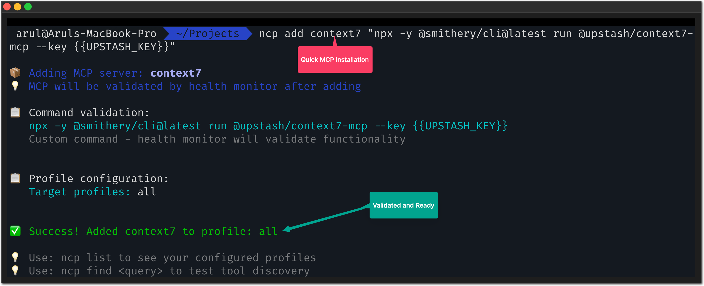

# NCP - Natural Context Provider

[](https://www.npmjs.com/package/@portel/ncp)
[](https://www.npmjs.com/package/@portel/ncp)
[](https://github.com/portel-dev/ncp/releases)
[](https://github.com/portel-dev/ncp/releases/latest)
[](https://www.elastic.co/licensing/elastic-license)
[](https://modelcontextprotocol.io/)

<!-- mcp-name: io.github.portel-dev/ncp -->

---

## 🎯 **One MCP to Rule Them All**

**Here's how it works, told as a story:**

Imagine you have 50 tools. Showing them all to your AI creates chaos - it can't decide which to use, wastes time analyzing options, and picks the wrong one 30% of the time.

**NCP changes the game:** Your AI doesn't see 50 tools. Instead, it dreams of the perfect tool it needs, and NCP finds it instantly through semantic search.

**The magic?** Your AI writes what it wants (a user story), NCP discovers the right tool from across ALL your MCPs, and execution happens immediately - no hesitation, no wrong choices, no wasted tokens.

**Result:** One unified interface transforms N scattered MCPs into focused, intelligent assistance.

---

## 😤 **The MCP Paradox: More Tools = Less Productivity**

You added MCPs to make your AI more powerful. Instead:

- **AI picks wrong tools** ("Should I use `read_file` or `get_file_content`?")
- **Sessions end early** ("I've reached my context limit analyzing tools")
- **Costs explode** (50+ schemas burn tokens before work even starts)
- **AI becomes indecisive** (used to act fast, now asks clarifying questions)

---

## 🧸 **Why Too Many Toys Break the Fun**

Think about it:

**A child with one toy** → Treasures it, masters it, creates endless games with it

**A child with 50 toys** → Can't hold them all, loses pieces, gets overwhelmed, stops playing entirely

**Your AI is that child.** MCPs are the toys. More isn't always better.

Or picture this: You're **craving pizza**. Someone hands you a pizza → Pure joy! 🍕

But take you to a **buffet with 200 dishes** → Analysis paralysis. You spend 20 minutes deciding, lose your appetite, leave unsatisfied.

**Same with your AI:** Give it one perfect tool → Instant action. Give it 50 tools → Cognitive overload.

The most creative people thrive with **constraints**, not infinite options. Your AI is no different.

**Think about it:**
- A poet with "write about anything" → Writer's block
- A poet with "write a haiku about rain" → Instant inspiration

- A developer with access to "all programming languages" → Analysis paralysis
- A developer with "Python for this task" → Focused solution

**Your AI needs the same focus.** NCP gives it constraints that spark creativity, not chaos that kills it.

---

## 📊 **The Before & After Reality**

### **Before NCP: Tool Schema Explosion** 😵‍💫

When your AI connects to multiple MCPs directly:

```
🤖 AI Assistant Context:
├── Filesystem MCP (12 tools) ─ 15,000 tokens
├── Database MCP (8 tools) ─── 12,000 tokens
├── Web Search MCP (6 tools) ── 8,000 tokens
├── Email MCP (15 tools) ───── 18,000 tokens
├── Shell MCP (10 tools) ───── 14,000 tokens
├── GitHub MCP (20 tools) ──── 25,000 tokens
└── Slack MCP (9 tools) ────── 11,000 tokens

💀 Total: 80 tools = 103,000 tokens of schemas
```

**What happens:**
- AI burns 50%+ of context just understanding what tools exist
- Spends 5-8 seconds analyzing which tool to use
- Often picks wrong tool due to schema confusion
- Hits context limits mid-conversation

### **After NCP: Unified Intelligence** ✨

With NCP's orchestration:

```
🤖 AI Assistant Context:
└── NCP (2 unified tools) ──── 2,500 tokens

🎯 Behind the scenes: NCP manages all 80 tools
📈 Context saved: 100,500 tokens (97% reduction!)
⚡ Decision time: Sub-second tool selection
🎪 AI behavior: Confident, focused, decisive
```

**Real results from our testing:**

| Your MCP Setup | Without NCP | With NCP | Token Savings |
|----------------|-------------|----------|---------------|
| **Small** (5 MCPs, 25 tools) | 15,000 tokens | 8,000 tokens | **47% saved** |
| **Medium** (15 MCPs, 75 tools) | 45,000 tokens | 12,000 tokens | **73% saved** |
| **Large** (30 MCPs, 150 tools) | 90,000 tokens | 15,000 tokens | **83% saved** |
| **Enterprise** (50+ MCPs, 250+ tools) | 150,000 tokens | 20,000 tokens | **87% saved** |

**Translation:**
- **5x faster responses** (8 seconds → 1.5 seconds)
- **12x longer conversations** before hitting limits
- **90% reduction** in wrong tool selection
- **Zero context exhaustion** in typical sessions

---

## 🌟 **How It Works: The Dream-and-Discover Story**

**Step 1: AI Dreams**
```
AI thinks: "I need to read a file..."
AI writes: "I want to read the contents of a file on disk"
```

**Step 2: NCP Discovers**
```
NCP semantic search:
  ├─ Converts dream to vector embedding
  ├─ Compares against ALL tool descriptions (cached)
  ├─ Ranks by semantic similarity (0.2 seconds)
  └─ Returns: filesystem:read_file (95% confidence)
```

**Step 3: AI Executes**
```
AI calls: run({ tool: "filesystem:read_file", params: {...} })
NCP loads filesystem MCP on-demand
Result returned instantly
```

**The magic:** AI's thought process is streamlined by writing a user story. It's forced to think clearly about *what* it needs, not *how* to do it.

---

## ✨ **What's New in v1.5.3**

### **🔐 Confirm Modifications Before Executing**

Server-side safety that asks before tools make changes. Protects against unwanted writes, deletes, and executions.

**How it works:**
- Uses semantic matching with tag-based patterns
- Catches file writes, command executions, database operations
- User can approve tools permanently ("Approve Always")
- Simple toggle: `ncp settings modifications on/off`

**Example:**
```
⚠️  Confirm Before Running

Tool: filesystem:write_file
Description: Create or overwrite a file

This operation matches your safety pattern (confidence: 46.4%)

Options:
  [R] Run Once      - Execute this time only
  [A] Approve Always - Never ask again for this tool
  [C] Cancel        - Don't execute
```

**Scientifically validated:**
- Tested against 83 real MCP tools
- 46.4% peak accuracy with hyphenated tag patterns
- Threshold 0.40 catches 5 critical operations (~6% of tools)
- **[Full documentation →](docs/confirm-before-run.md)**

### **🔍 Enhanced Discovery Engine**

- Improved semantic search accuracy
- Better caching with embeddings
- Faster tool discovery (<100ms for cached queries)
- More intelligent ranking algorithms

### **📦 Desktop Extension (.dxt)**

One-click installation for Claude Desktop users:
- Download → Double-click → Done (30 seconds)
- Auto-syncs all Claude Desktop MCPs
- Dynamic runtime detection
- Tiny bundle size (126KB, MCP-only)
- **[Complete guide →](docs/claude-desktop.md)**

### **🔄 Auto-Sync from Claude Desktop**

NCP continuously syncs MCPs from Claude Desktop on every startup:
- Detects MCPs from `claude_desktop_config.json`
- Detects .mcpb-installed extensions
- Zero manual configuration needed
- Always in sync automatically

### **🎯 Official Registry Integration**

AI can search and install MCPs through conversation:
```
You: "Find database MCPs"
AI: Shows numbered list from 2,200+ MCPs
You: "Install 1 and 2"
AI: Installs PostgreSQL and SQLite ✅
```

---

## 📋 **Prerequisites**

- **Node.js 18+** ([Download here](https://nodejs.org/))
- **npm** (included with Node.js) or **npx** for running packages
- **Command line access** (Terminal on Mac/Linux, Command Prompt/PowerShell on Windows)

## 🚀 **Installation**

Choose your preferred installation method:

| Method | Best For | Downloads |
|--------|----------|-----------|
| **📦 .dxt Extension** | Claude Desktop users |  |
| **📥 npm Package** | All MCP clients, CLI users |  |

### **⚡ Option 1: One-Click Installation (.dxt)** - Claude Desktop Only

**For Claude Desktop users** - Download and double-click to install:

1. **Download NCP Desktop Extension:** [ncp.dxt](https://github.com/portel-dev/ncp/releases/latest/download/ncp.dxt)
2. **Double-click** the downloaded `ncp.dxt` file
3. **Claude Desktop** will prompt you to install - click "Install"
4. **Auto-sync with Claude Desktop** - NCP continuously syncs MCPs:
   - Detects MCPs from `claude_desktop_config.json`
   - Detects .mcpb-installed extensions
   - **Runs on every startup** to find new MCPs
   - Uses internal `add` command for cache coherence

> 🔄 **Continuous sync:** NCP automatically detects and imports new MCPs every time you start it! Add an MCP to Claude Desktop → NCP auto-syncs it on next startup. Zero manual configuration needed.

**Complete guide with screenshots:** [docs/claude-desktop.md](docs/claude-desktop.md)

If you want to add more MCPs later, **configure manually** by editing `~/.ncp/profiles/all.json`:

```bash
# Edit the profile configuration
nano ~/.ncp/profiles/all.json
```

```json
{
  "mcpServers": {
    "filesystem": {
      "command": "npx",
      "args": ["-y", "@modelcontextprotocol/server-filesystem", "/Users/yourname"]
    },
    "github": {
      "command": "npx",
      "args": ["-y", "@modelcontextprotocol/server-github"],
      "env": {
        "GITHUB_PERSONAL_ACCESS_TOKEN": "ghp_xxx"
      }
    }
  }
}
```

5. **Restart Claude Desktop** and NCP will load your configured MCPs

> ℹ️ **About .dxt (Desktop Extension) installation:**
> - **Slim & Fast:** Desktop extension is MCP-only (126KB, no CLI code)
> - **Manual config:** Edit JSON files directly (no `ncp add` command)
> - **Power users:** Fastest startup, direct control over configuration
> - **Optional CLI:** Install `npm install -g @portel/ncp` separately if you want CLI tools
>
> **Why .dxt is slim:**
> The desktop extension excludes all CLI code, making it 13% smaller and faster to load than the full npm package. Perfect for production use where you manage configs manually or via automation.

---

### **🔧 Option 2: npm Installation** - All MCP Clients (Cursor, Cline, Continue, etc.)

### **Step 1: Import Your Existing MCPs** ⚡

Already have MCPs? Don't start over - import everything instantly:

```bash
# Install NCP globally (recommended)
npm install -g @portel/ncp

# Copy your claude_desktop_config.json content to clipboard:
# 1. Open your claude_desktop_config.json file (see locations above)
# 2. Select all content (Ctrl+A / Cmd+A) and copy (Ctrl+C / Cmd+C)
# 3. Then run:
ncp config import

# ✨ Magic! NCP auto-detects and imports ALL your MCPs from clipboard
```

> **Note:** All commands below assume global installation (`npm install -g`). For npx usage, see the [Alternative Installation](#alternative-installation-with-npx) section.


### **Step 2: Connect NCP to Your AI** 🔗

Replace your entire MCP configuration with this **single entry**:

```json
{
  "mcpServers": {
    "ncp": {
      "command": "ncp"
    }
  }
}
```

### **Step 3: Watch the Magic** ✨

Your AI now sees just 2 simple tools instead of 50+ complex ones:


**🎉 Done!** Same tools, same capabilities, but your AI is now **focused** and **efficient**.

---

## 🧪 **Test Drive: See the Difference Yourself**

Want to experience what your AI experiences? NCP has a human-friendly CLI:

### **🔍 Smart Discovery**
```bash
# Ask like your AI would ask:
ncp find "I need to read a file"
ncp find "help me send an email"
ncp find "search for something online"
```


**Notice:** NCP understands intent, not just keywords. Just like your AI needs.

### **📋 Ecosystem Overview**
```bash
# See your complete MCP ecosystem:
ncp list --depth 2

# Get help anytime:
ncp --help
```


### **⚡ Direct Testing**
```bash
# Test any tool safely:
ncp run filesystem:read_file --params '{"path": "/tmp/test.txt"}'
```

**Why this matters:** You can debug and test tools directly, just like your AI would use them.

### **⚙️ Configure Safety**
```bash
# Check modification confirmation status
ncp settings modifications

# Enable/disable confirmations
ncp settings modifications on
ncp settings modifications off

# Manage approved tools
ncp settings whitelist list
ncp settings whitelist clear
```

### **✅ Verify Everything Works**

```bash
# 1. Check NCP is installed correctly
ncp --version

# 2. Confirm your MCPs are imported
ncp list

# 3. Test tool discovery
ncp find "file"

# 4. Test a simple tool (if you have filesystem MCP)
ncp run filesystem:read_file --params '{"path": "/tmp/test.txt"}' --dry-run
```

**✅ Success indicators:**
- NCP shows version number
- `ncp list` shows your imported MCPs
- `ncp find` returns relevant tools
- Your AI client shows only NCP in its tool list

---

## 🔄 **Alternative Installation with npx**

Prefer not to install globally? Use `npx` for any client configuration:

```bash
# All the above commands work with npx - just replace 'ncp' with 'npx @portel/ncp':

# Import MCPs
npx @portel/ncp config import

# Add MCPs
npx @portel/ncp add filesystem npx @modelcontextprotocol/server-filesystem ~/Documents

# Find tools
npx @portel/ncp find "file operations"

# Configure client (example: Claude Desktop)
{
  "mcpServers": {
    "ncp": {
      "command": "npx",
      "args": ["@portel/ncp"]
    }
  }
}
```

> **When to use npx:** Perfect for trying NCP, CI/CD environments, or when you can't install packages globally.

---

## 💡 **Why NCP Transforms Your AI Experience**

### **🧠 Restores AI Focus**
- **Before:** "I see 50 tools... which should I use... let me think..."
- **After:** "I need file access. Done." *(sub-second decision)*

### **💰 Massive Token Savings**
- **Before:** 100k+ tokens just for tool schemas
- **After:** 2.5k tokens for unified interface
- **Result:** 40x token efficiency = 40x longer conversations

### **🎯 Eliminates Tool Confusion**
- **Before:** AI picks `read_file` when you meant `search_files`
- **After:** NCP's semantic engine finds the RIGHT tool for the task

### **🚀 Faster, Smarter Responses**
- **Before:** 8-second delay analyzing tool options
- **After:** Instant tool selection, immediate action

### **🔐 Built-in Safety**
- **Before:** No control over dangerous operations
- **After:** Confirm-before-run protects against unwanted modifications

**Bottom line:** Your AI goes from overwhelmed to **laser-focused**.

---

## 🛠️ **For Power Users: Manual Setup**

Prefer to build from scratch? Add MCPs manually:

```bash
# Add the most popular MCPs:

# AI reasoning and memory
ncp add sequential-thinking npx @modelcontextprotocol/server-sequential-thinking
ncp add memory npx @modelcontextprotocol/server-memory

# File and development tools
ncp add filesystem npx @modelcontextprotocol/server-filesystem ~/Documents  # Path: directory to access
ncp add github npx @modelcontextprotocol/server-github                       # No path needed

# Search and productivity
ncp add brave-search npx @modelcontextprotocol/server-brave-search           # No path needed
```



**💡 Pro tip:** Browse [Smithery.ai](https://smithery.ai) (2,200+ MCPs) or [mcp.so](https://mcp.so) to discover tools for your specific needs.

---

## 🎯 **Popular MCPs That Work Great with NCP**

### **🔥 Most Downloaded**
```bash
# Community favorites (download counts from Smithery.ai):
ncp add sequential-thinking npx @modelcontextprotocol/server-sequential-thinking  # 5,550+ downloads
ncp add memory npx @modelcontextprotocol/server-memory                            # 4,200+ downloads
ncp add brave-search npx @modelcontextprotocol/server-brave-search                # 680+ downloads
```

### **🛠️ Development Essentials**
```bash
# Popular dev tools:
ncp add filesystem npx @modelcontextprotocol/server-filesystem ~/code
ncp add github npx @modelcontextprotocol/server-github
ncp add shell npx @modelcontextprotocol/server-shell
```

### **🌐 Productivity & Integrations**
```bash
# Enterprise favorites:
ncp add gmail npx @mcptools/gmail-mcp
ncp add slack npx @modelcontextprotocol/server-slack
ncp add google-drive npx @modelcontextprotocol/server-gdrive
ncp add postgres npx @modelcontextprotocol/server-postgres
ncp add puppeteer npx @hisma/server-puppeteer
```

---

## ⚙️ **Configuration for Different AI Clients**

### **Claude Desktop** (Most Popular)

**See complete guide with screenshots:** [docs/claude-desktop.md](docs/claude-desktop.md)

**Configuration File Location:**
- **macOS:** `~/Library/Application Support/Claude/claude_desktop_config.json`
- **Windows:** `%APPDATA%\Claude\claude_desktop_config.json`
- **Linux:** `~/.config/Claude/claude_desktop_config.json`

Replace your entire `claude_desktop_config.json` with:
```json
{
  "mcpServers": {
    "ncp": {
      "command": "ncp"
    }
  }
}
```

**📌 Important:** Restart Claude Desktop after saving the config file.

> **Note:** Configuration file locations are current as of this writing. For the most up-to-date setup instructions, please refer to the [official Claude Desktop documentation](https://claude.ai/docs).

### **Claude Code**
NCP works automatically! Just run:
```bash
ncp add <your-mcps>
```

### **VS Code with GitHub Copilot**

**Settings File Location:**
- **macOS:** `~/Library/Application Support/Code/User/settings.json`
- **Windows:** `%APPDATA%\Code\User\settings.json`
- **Linux:** `~/.config/Code/User/settings.json`

Add to your VS Code `settings.json`:
```json
{
  "mcp.servers": {
    "ncp": {
      "command": "ncp"
    }
  }
}
```

**📌 Important:** Restart VS Code after saving the settings file.

> **Disclaimer:** Configuration paths and methods are accurate as of this writing. VS Code and its extensions may change these locations or integration methods. Please consult the [official VS Code documentation](https://code.visualstudio.com/docs) for the most current information.

### **Cursor IDE**
```json
{
  "mcp": {
    "servers": {
      "ncp": {
        "command": "ncp"
      }
    }
  }
}
```

> **Disclaimer:** Configuration format and location may vary by Cursor IDE version. Please refer to [Cursor's official documentation](https://cursor.sh/docs) for the most up-to-date setup instructions.

---

## 🔧 **Advanced Features**

### **Smart Health Monitoring**
NCP automatically detects broken MCPs and routes around them:

```bash
ncp list --depth 1    # See health status
ncp config validate   # Check configuration health
```

**🎯 Result:** Your AI never gets stuck on broken tools.

### **Multi-Profile Organization**
Organize MCPs by project or environment:

```bash
# Development setup
ncp add --profile dev filesystem npx @modelcontextprotocol/server-filesystem ~/dev

# Production setup
ncp add --profile prod database npx production-db-server

# Use specific profile
ncp --profile dev find "file tools"
```

### **🚀 Project-Level Configuration**
**New:** Configure MCPs per project with automatic detection - perfect for teams and Cloud IDEs:

```bash
# In any project directory, create local MCP configuration:
mkdir .ncp
ncp add filesystem npx @modelcontextprotocol/server-filesystem ./
ncp add github npx @modelcontextprotocol/server-github

# NCP automatically detects and uses project-local configuration
ncp find "save file"  # Uses only project MCPs
```

**How it works:**
- 📁 **Local `.ncp` directory exists** → Uses project configuration
- 🏠 **No local `.ncp` directory** → Falls back to global `~/.ncp`
- 🎯 **Zero profile management needed** → Everything goes to default `all.json`

**Perfect for:**
- 🤖 **Claude Code projects** (project-specific MCP tooling)
- 👥 **Team consistency** (ship `.ncp` folder with your repo)
- 🔧 **Project-specific tooling** (each project defines its own MCPs)
- 📦 **Environment isolation** (no global MCP conflicts)

```bash
# Example project structures:
frontend-app/
  .ncp/profiles/all.json   # → playwright, lighthouse, browser-context
  src/

api-backend/
  .ncp/profiles/all.json   # → postgres, redis, docker, kubernetes
  server/
```

### **Import from Anywhere**
```bash
# From clipboard (any JSON config)
ncp config import

# From specific file
ncp config import "~/my-mcp-config.json"

# From Claude Desktop (auto-detected paths)
ncp config import
```

---

## 🛟 **Troubleshooting**

### **Import Issues**
```bash
# Check what was imported
ncp list

# Validate health of imported MCPs
ncp config validate

# See detailed import logs
DEBUG=ncp:* ncp config import
```

### **AI Not Using Tools**
- **Check connection:** `ncp list` (should show your MCPs)
- **Test discovery:** `ncp find "your query"`
- **Validate config:** Ensure your AI client points to `ncp` command

### **Performance Issues**
```bash
# Check MCP health (unhealthy MCPs slow everything down)
ncp list --depth 1

# Clear cache if needed
rm -rf ~/.ncp/cache

# Monitor with debug logs
DEBUG=ncp:* ncp find "test"
```

---

## 📚 **Deep Dive: How It Works**

Want the technical details? Token analysis, architecture diagrams, and performance benchmarks:

📖 **[Read the Technical Guide →](HOW-IT-WORKS.md)**

Learn about:
- Vector similarity search algorithms
- N-to-1 orchestration architecture
- Real-world token usage comparisons
- Health monitoring and failover systems

---

## 🤝 **Contributing**

Help make NCP even better:

- 🐛 **Bug reports:** [GitHub Issues](https://github.com/portel-dev/ncp/issues)
- 💡 **Feature requests:** [GitHub Discussions](https://github.com/portel-dev/ncp/discussions)
- 🔄 **Pull requests:** [Contributing Guide](CONTRIBUTING.md)

---

## 📄 **License**

Elastic License 2.0 - [Full License](LICENSE)

**TLDR:** Free for all use including commercial. Cannot be offered as a hosted service to third parties.
