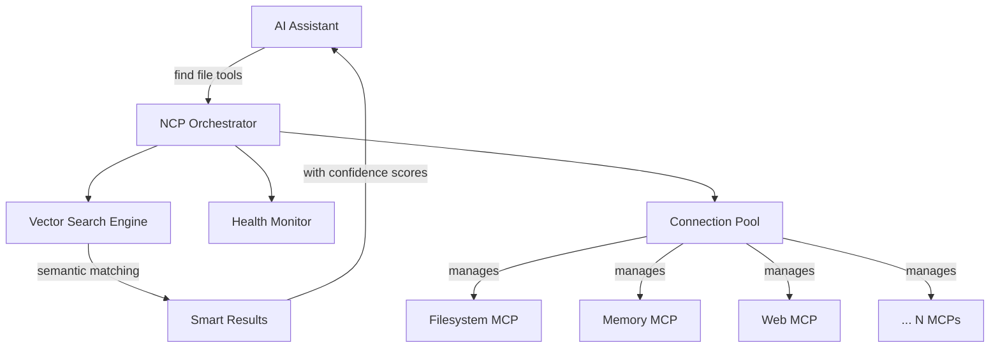

[](https://www.npmjs.com/package/@portel/ncp)
[](https://www.npmjs.com/package/@portel/ncp)
[](https://www.elastic.co/licensing/elastic-license)
[](https://modelcontextprotocol.io/)

# NCP - Natural Context Provider

## 🎯 **One MCP to Rule Them All**

*Tired of your AI assistant struggling with dozens of different MCP tools? Frustrated by slow responses and massive token costs?*

**NCP** transforms the chaos of N scattered MCP servers into 1 intelligent orchestrator. Your AI gets a clean, unified interface that dramatically **reduces cognitive load**, **saves tokens**, and **speeds up responses**.

---

## 🚀 **60-Second Quick Start**

### **Step 1: Install NCP Globally** 📦
```bash
npm install -g @portel/ncp
```

### **Step 2A: Add Popular MCPs Manually** ⚡
```bash
# Add the most popular MCPs (based on community usage):

# Sequential thinking (5,550+ downloads) - AI reasoning tool
ncp add sequential-thinking npx @modelcontextprotocol/server-sequential-thinking

# Memory capabilities - persistent storage
ncp add memory npx @modelcontextprotocol/server-memory

# Brave search (680+ downloads) - web research
ncp add brave-search npx @modelcontextprotocol/server-brave-search

# Filesystem tools - secure file operations
ncp add filesystem npx @modelcontextprotocol/server-filesystem /tmp
```

**💡 Tip**: These are just popular examples! Browse [Smithery.ai](https://smithery.ai) (2,211+ servers) or [mcp.so](https://mcp.so) to discover MCPs for your specific needs.

*[SCREENSHOT PLACEHOLDER: Terminal showing successful MCP additions with NCP's helpful guidance messages]*

### **Step 2B: Import Existing MCPs (Faster!)** 🚀
Already have MCPs configured in Claude Desktop? Just copy and import them:

```bash
# Copy your existing claude_desktop_config.json
# Then run this magic command:
ncp config import

# NCP will auto-detect clipboard content and import everything!
```

*[SCREENSHOT PLACEHOLDER: Terminal showing smart clipboard detection and successful import of multiple MCPs]*

### **Step 3: Connect NCP to Claude Desktop** 🔗
Add this **single entry** to your `claude_desktop_config.json`:
```json
{
  "mcpServers": {
    "ncp": {
      "command": "ncp"
    }
  }
}
```

**🎉 Done!** Your AI now has intelligent access to ALL your MCP tools through one clean interface.

*[SCREENSHOT PLACEHOLDER: Before/After comparison - cluttered config with 15+ MCP entries vs clean single NCP entry]*

---

## 🚗 **Want to Feel Why AIs Love NCP? Take It for a Test Drive!**

Curious about what makes NCP so powerful for AI assistants? **Experience it yourself!**

NCP isn't just for AIs - we've built a **human-friendly CLI** that lets you explore, discover, and test any MCP tool exactly like your AI assistant would. Think of it as getting behind the wheel to understand why the ride is so smooth.

### **🧪 The Ultimate MCP Laboratory**
```bash
# Ask NCP what your AI assistant would ask:
ncp find "I need to process images"      # → Discover image tools
ncp find "help me with databases"       # → Find database MCPs
ncp find "social media automation"      # → Explore social tools

# See the full picture of your MCP ecosystem:
ncp list --depth 2                      # Every tool, every capability

# Test drive any tool (safely!):
ncp run brave-search:search --params '{"query": "Model Context Protocol"}'
```

### **✨ Why This Matters**
- **Understand your AI's perspective**: See exactly how semantic discovery works
- **Debug MCP issues**: Test tools directly without involving your AI
- **Explore capabilities**: Discover what's possible with your current setup
- **Validate configurations**: Ensure everything works before your AI tries it

**Ready to see what the fuss is about?** Install NCP and take the test drive! 🏁

---

## ✨ **Watch the Magic Happen**

### **Before NCP: Cognitive Overload** 😵‍💫
Your AI sees this overwhelming mess:
```
📁 filesystem-server (12 tools)
📁 memory-server (8 tools)
📁 web-search-server (6 tools)
📁 email-server (15 tools)
📁 calendar-server (9 tools)
... and 20 more servers with 200+ tools
```

**Result**: Slow responses, poor tool choices, massive token usage

### **After NCP: Intelligent Discovery** ✨
Your AI simply asks NCP:
```bash
> "I need to find files containing 'config'"
```

And gets exactly what it needs:
```
🔍 Found tools for "file operations":
└── filesystem (95.2% match)
    ├── read_file - Read file contents
    └── search_files - Search for files by pattern
```

*[SCREENSHOT PLACEHOLDER: NCP find command showing clean, organized results with confidence scores]*

---

## 💡 **Why NCP Transforms Your AI Experience**

### **🧠 Reduces Cognitive Load**
- **Before**: AI processes 200+ tool schemas → confusion & poor choices
- **After**: AI sees just 2 tools (`find` & `run`) → smart routing behind the scenes

### **💰 Massive Token Savings**
| Setup Size | Without NCP | With NCP | Savings |
|------------|-------------|----------|---------|
| **Small** (5 MCPs) | 15,000 tokens | 8,000 tokens | **47%** |
| **Medium** (15 MCPs) | 45,000 tokens | 12,000 tokens | **73%** |
| **Large** (30+ MCPs) | 90,000+ tokens | 15,000 tokens | **83%** |

### **⚡ Lightning Fast Responses**
- **Before**: 3-8 seconds (analysis paralysis)
- **After**: Sub-second responses (intelligent discovery)

### **🔧 Memory & Process Efficiency**
- **Lazy Loading**: MCPs only started when needed
- **Health Monitoring**: Broken tools automatically excluded
- **Smart Caching**: Vector embeddings cached for instant retrieval

---

## 📋 **Essential Commands for Your Test Drive**

NCP's CLI gives you the same intelligent interface your AI uses - perfect for exploring and understanding your MCP ecosystem:

*[SCREENSHOT PLACEHOLDER: `ncp --help` output showing the helpful command structure and Quick Start section]*

### **MCP Management**
```bash
ncp add <name> <command> [args...]     # Add MCP server
ncp remove <name>                      # Remove MCP server
ncp list                               # Show all configured MCPs

# Import existing configurations (powerful!)
ncp config import                      # Smart clipboard import
ncp config import <file>               # Import from file
ncp config validate                    # Check configuration health
```

*[SCREENSHOT PLACEHOLDER: `ncp list` output showing organized MCP structure]*

### **🚗 Interactive Testing & Discovery**
Experience NCP's intelligence firsthand - these commands work exactly like your AI's interface:

```bash
# 🔍 Natural language discovery (think like your AI!)
ncp find "edit files"                  # Find file editing tools
ncp find "web search"                  # Discover search capabilities
ncp find "database operations"         # Explore data tools

# 📋 Comprehensive overview
ncp list                               # Show all your configured MCPs
ncp list --depth 2                     # Deep dive with tool details

# 🎯 Direct tool execution (safe testing!)
ncp run filesystem:read_file --params '{"path": "./README.md"}'
ncp run memory:create_memory --params '{"content": "Test note"}'
```

**💡 Test Drive Tip**: Use the same natural language queries you'd give your AI assistant - you'll see exactly how NCP's semantic discovery works!

*[SCREENSHOT PLACEHOLDER: `ncp find "file operations"` showing semantic search results with confidence scores]*


---

## 🛠️ **Installation & Setup**

### **Prerequisites**
- Node.js 18+
- **Your favorite AI client that supports MCP:**
  - Claude Desktop
  - Claude Code (supports `ncp add` command!)
  - Cursor IDE
  - VS Code with GitHub Copilot extension
  - *Or any other MCP-compatible client - refer to their documentation for setup*

### **Method 1: Global Installation (Recommended)**
```bash
npm install -g @portel/ncp
```

### **Method 2: NPX (No Install)**
```json
{
  "mcpServers": {
    "ncp": {
      "command": "npx",
      "args": ["@portel/ncp"]
    }
  }
}
```

### **Verify Installation**
```bash
ncp --help                             # Should show helpful interface
ncp find "test"                        # Should work (empty initially)
```

---

## ⚙️ **Configuration**

### **Claude Desktop Setup**
Config file locations:
- **macOS:** `~/Library/Application Support/Claude/claude_desktop_config.json`
- **Windows:** `%APPDATA%\Claude\claude_desktop_config.json`
- **Linux:** `~/.config/Claude/claude_desktop_config.json`

Add this configuration:
```json
{
  "mcpServers": {
    "ncp": {
      "command": "ncp"
    }
  }
}
```

*For detailed Claude Desktop MCP setup, refer to [Claude's official documentation](https://docs.claude.com/docs/claude-code/mcp)*

### **Claude Code Setup**
Config file locations:
- **Global:** `~/.claude.json` (highest priority)
- **User:** `~/.claude/settings.json`
- **Project:** `.claude/settings.local.json` (in project root)

**Special Feature**: Claude Code can directly run `ncp add` commands!
```json
{
  "mcpServers": {
    "ncp": {
      "command": "ncp"
    }
  }
}
```

*For detailed Claude Code MCP setup, refer to [Claude Code's official MCP documentation](https://docs.claude.com/en/docs/claude-code/mcp)*

### **VS Code Setup (with GitHub Copilot)**
Requirements: VS Code 1.99+ with GitHub Copilot extension installed

Config file locations:
- **Workspace:** `.vscode/mcp.json` (in project root)
- **Global:** Run command `MCP: Open User Configuration` to access

Add this configuration:
```json
{
  "mcpServers": {
    "ncp": {
      "command": "ncp"
    }
  }
}
```

**Note**: MCP support in VS Code requires GitHub Copilot. For organizations, the "MCP servers in Copilot" policy must be enabled by your administrator.

*For detailed VS Code MCP setup, refer to [VS Code's official MCP documentation](https://code.visualstudio.com/docs/copilot/chat/mcp-servers)*

### **Cursor IDE Setup**
Config file locations:
- **Global:** `~/.cursor/mcp.json` (all projects)
- **Project:** `.cursor/mcp.json` (in project root)
- **Desktop:**
  - macOS: `~/Library/Application Support/Cursor/cursor_desktop_config.json`
  - Windows: `%APPDATA%\Cursor\cursor_desktop_config.json`

Add this configuration:
```json
{
  "mcpServers": {
    "ncp": {
      "command": "ncp"
    }
  }
}
```

*For detailed Cursor IDE MCP setup, refer to [Cursor's official MCP documentation](https://docs.cursor.com/context/model-context-protocol)*

---

## 🎯 **Popular MCP Servers to Try**

**Note**: These are examples of popular community-used MCPs. **Use your favorite MCP servers** that match your specific workflow needs!

### **🔥 Most Downloaded (Based on Smithery.ai data)**
```bash
# Top community favorites:
ncp add sequential-thinking npx @modelcontextprotocol/server-sequential-thinking  # 5,550+ uses
ncp add brave-search npx @modelcontextprotocol/server-brave-search              # 680+ uses
ncp add memory npx @modelcontextprotocol/server-memory                          # Essential for AI
```

### **🛠️ Development Essentials**
```bash
# Popular development MCPs:
ncp add filesystem npx @modelcontextprotocol/server-filesystem ~/code
ncp add git npx @modelcontextprotocol/server-git --repository=./
ncp add github npx @modelcontextprotocol/server-github
```

### **🌐 Productivity & Integrations**
```bash
# Enterprise favorites:
ncp add slack npx @modelcontextprotocol/server-slack
ncp add postgres npx @modelcontextprotocol/server-postgres
ncp add notion npx @modelcontextprotocol/server-notion
```

**🔍 Discover More**: Explore thousands of MCPs at [Smithery.ai](https://smithery.ai) (2,211+ servers), [mcp.so](https://mcp.so), or [MCPServerFinder.com](https://mcpserverfinder.com) to find the perfect tools for your workflow!


---

## 🔧 **Advanced Features**

### **Smart Configuration Import** 📥
The most powerful way to get started - import your existing MCP configurations:

#### **Clipboard Import (Instant)**
```bash
# 1. Copy any MCP JSON configuration to clipboard
# 2. Run the magic command
ncp config import

# NCP automatically detects and displays your JSON:
# ✅ Shows highlighted JSON in bordered box
# ✅ Single MCP config → Prompts for name
# ✅ Multiple MCPs → Imports all with names
# ✅ Detailed success/failure messages
```

#### **File Import (Direct)**
```bash
# Import from any JSON config file
ncp config import "/path/to/your/config.json"

# Common examples:
# Claude Desktop (macOS)
ncp config import "~/Library/Application Support/Claude/claude_desktop_config.json"

# Claude Desktop (Windows)
ncp config import "%APPDATA%\Claude\claude_desktop_config.json"

# VS Code or any other JSON MCP config
ncp config import "./my-mcp-config.json"
```

*[SCREENSHOT PLACEHOLDER: Split screen showing clipboard import with highlighted JSON vs file import]*

### **Semantic Discovery**
NCP uses vector similarity search to find the right tools:
```bash
ncp find "send an email"        # → email:send_message (94.2%)
ncp find "create database"      # → postgres:create_table (89.7%)
ncp find "web scraping"         # → browser:extract_content (91.3%)
```

### **Health-Aware Execution**
If a tool becomes unavailable, NCP automatically provides alternatives:
```
> Tool 'filesystem:read_file' is currently unavailable
> 💡 Alternatives found:
>   • local-files:read_file (88% similarity)
>   • file-manager:get_content (82% similarity)
```

### **Profile-Based Organization** 🎯
Not all fingers are equal - different clients and environments require different sets of tools. NCP provides profiles to organize your MCPs for specific purposes:

#### **Why Profiles?**
- **Development vs Production**: Different API keys and permissions
- **Client-Specific**: Each AI client gets only the tools it needs
- **Security**: Isolate sensitive tools from general use
- **Performance**: Load only relevant MCPs for faster responses

#### **Working with Profiles**
```bash
# Add MCPs to specific profiles
ncp add filesystem npx @modelcontextprotocol/server-filesystem ~/code --profiles dev
ncp add stripe npx stripe-cli --profiles dev --env API_KEY=sk_test_...
ncp add stripe npx stripe-cli --profiles prod --env API_KEY=sk_live_...

# List MCPs in specific profile
ncp list --profile dev

# Deploy to multiple profiles at once
ncp add logger npx @mcp/logger --profiles dev,test,staging
```

#### **Using Profiles in Your AI Client**
```json
{
  "mcpServers": {
    "ncp-dev": {
      "command": "ncp",
      "args": ["--profile", "dev"]
    },
    "ncp-prod": {
      "command": "ncp",
      "args": ["--profile", "prod"]
    }
  }
}
```

**Note**: When no profile is specified, NCP uses the universal "all" profile by default.


---

## 🛟 **Troubleshooting**

### **Common Issues**

**"No tools found" responses:**
```bash
ncp list                               # Check configured MCPs
ncp find "debug" --depth 2             # Detailed tool search
```

**Performance issues:**
```bash
ncp list --depth 1                     # Check MCP health status
```

**Configuration validation:**
```bash
ncp config validate                    # Check setup
ncp config location                    # Show config files
```

*[SCREENSHOT PLACEHOLDER: `ncp config validate` output showing health checks]*

### **Getting Help**
- **Issues:** [GitHub Issues](https://github.com/portel-dev/ncp/issues)
- **Discussions:** [GitHub Discussions](https://github.com/portel-dev/ncp/discussions)

---

## 📚 **How It Works**

NCP operates as both an **MCP server** (to your AI client) and an **MCP client** (to downstream MCPs):



**The Magic**: NCP maintains real connections to all your MCP servers, but presents them through one intelligent interface that speaks your AI's language.

📚 **Want the deep technical details?** See [HOW_IT_WORKS.md](HOW_IT_WORKS.md) for token analysis, architecture diagrams, and performance benchmarks.

---

## 🤝 **Contributing**

We'd love your help making NCP even better!

- 🐛 **Bug reports**: [GitHub Issues](https://github.com/portel-dev/ncp/issues)
- 💡 **Feature requests**: [GitHub Discussions](https://github.com/portel-dev/ncp/discussions)
- 🔧 **Pull requests**: See [CONTRIBUTING.md](CONTRIBUTING.md)

---

## 📄 **License**

**Elastic License 2.0** - See [LICENSE](LICENSE) for details.

---

**Ready to transform your AI experience? Install NCP now and taste the power of unified MCP orchestration! 🚀**

```bash
npm install -g @portel/ncp
```