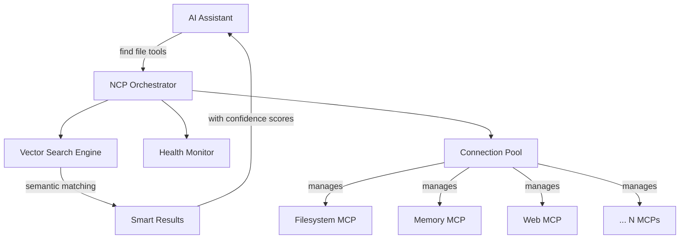

[](https://www.npmjs.com/package/@portel/ncp)
[](https://www.npmjs.com/package/@portel/ncp)
[](https://www.elastic.co/licensing/elastic-license)
[](https://modelcontextprotocol.io/)

# NCP - Natural Context Provider

## 🎯 **One MCP to Rule Them All**

*Tired of your AI assistant struggling with dozens of different MCP tools? Frustrated by slow responses and massive token costs?*

**NCP** transforms the chaos of N scattered MCP servers into 1 intelligent orchestrator. Your AI gets a clean, unified interface that dramatically **reduces cognitive load**, **saves tokens**, and **speeds up responses**.

---

## 🚀 **60-Second Quick Start**

### **Step 1: Install NCP Globally** 📦
```bash
npm install -g @portel/ncp
```

### **Step 2A: Add MCPs Manually** ⚡
```bash
# Add filesystem tools
ncp add filesystem npx @modelcontextprotocol/server-filesystem /tmp

# Add memory capabilities
ncp add memory npx @modelcontextprotocol/server-memory

# Add web search
ncp add web-search npx @mcptools/mcp-tavily
```

*[SCREENSHOT PLACEHOLDER: Terminal showing successful MCP additions with NCP's helpful guidance messages]*

### **Step 2B: Import Existing MCPs (Faster!)** 🚀
Already have MCPs configured in Claude Desktop? Just copy and import them:

```bash
# Copy your existing claude_desktop_config.json
# Then run this magic command:
ncp config import

# NCP will auto-detect clipboard content and import everything!
```

*[SCREENSHOT PLACEHOLDER: Terminal showing smart clipboard detection and successful import of multiple MCPs]*

### **Step 3: Connect NCP to Claude Desktop** 🔗
Add this **single entry** to your `claude_desktop_config.json`:
```json
{
  "mcpServers": {
    "ncp": {
      "command": "ncp",
      "args": ["--profile", "all"]
    }
  }
}
```

**🎉 Done!** Your AI now has intelligent access to ALL your MCP tools through one clean interface.

*[SCREENSHOT PLACEHOLDER: Before/After comparison - cluttered config with 15+ MCP entries vs clean single NCP entry]*

---

## ✨ **Watch the Magic Happen**

### **Before NCP: Cognitive Overload** 😵‍💫
Your AI sees this overwhelming mess:
```
📁 filesystem-server (12 tools)
📁 memory-server (8 tools)
📁 web-search-server (6 tools)
📁 email-server (15 tools)
📁 calendar-server (9 tools)
... and 20 more servers with 200+ tools
```

**Result**: Slow responses, poor tool choices, massive token usage

### **After NCP: Intelligent Discovery** ✨
Your AI simply asks NCP:
```bash
> "I need to find files containing 'config'"
```

And gets exactly what it needs:
```
🔍 Found tools for "file operations":
└── filesystem (95.2% match)
    ├── read_file - Read file contents
    └── search_files - Search for files by pattern
```

*[SCREENSHOT PLACEHOLDER: NCP find command showing clean, organized results with confidence scores]*

---

## 💡 **Why NCP Transforms Your AI Experience**

### **🧠 Reduces Cognitive Load**
- **Before**: AI processes 200+ tool schemas → confusion & poor choices
- **After**: AI sees just 2 tools (`find` & `run`) → smart routing behind the scenes

### **💰 Massive Token Savings**
| Setup Size | Without NCP | With NCP | Savings |
|------------|-------------|----------|---------|
| **Small** (5 MCPs) | 15,000 tokens | 8,000 tokens | **47%** |
| **Medium** (15 MCPs) | 45,000 tokens | 12,000 tokens | **73%** |
| **Large** (30+ MCPs) | 90,000+ tokens | 15,000 tokens | **83%** |

### **⚡ Lightning Fast Responses**
- **Before**: 3-8 seconds (analysis paralysis)
- **After**: Sub-second responses (intelligent discovery)

### **🔧 Memory & Process Efficiency**
- **Lazy Loading**: MCPs only started when needed
- **Health Monitoring**: Broken tools automatically excluded
- **Smart Caching**: Vector embeddings cached for instant retrieval

---

## 📋 **Essential Commands**

NCP's CLI is designed to guide you through the right workflow:

*[SCREENSHOT PLACEHOLDER: `ncp --help` output showing the helpful command structure and Quick Start section]*

### **MCP Management**
```bash
ncp add <name> <command> [args...]     # Add MCP server
ncp remove <name>                      # Remove MCP server
ncp list                               # Show all profiles & MCPs

# Import existing configurations (powerful!)
ncp config import                      # Smart clipboard/editor import
ncp config import <file>               # Import from file
ncp config validate                    # Check configuration health
```

*[SCREENSHOT PLACEHOLDER: `ncp list` output showing organized profile structure]*

### **Discovery & Testing**
```bash
ncp find <query>                       # Natural language search
ncp run <tool> --params <json>         # Execute specific tool
```

*[SCREENSHOT PLACEHOLDER: `ncp find "file operations"` showing semantic search results]*

### **Profile Management**
```bash
# Create focused environments
ncp add filesystem npx @modelcontextprotocol/server-filesystem ~/code --profiles dev
ncp add stripe npx stripe-cli --profiles prod --env API_KEY=sk_live_...
```

---

## 🛠️ **Installation & Setup**

### **Prerequisites**
- Node.js 18+
- Your favorite AI client that supports MCP (Claude Desktop, VS Code, Cursor)

### **Method 1: Global Installation (Recommended)**
```bash
npm install -g @portel/ncp
```

### **Method 2: NPX (No Install)**
```json
{
  "mcpServers": {
    "ncp": {
      "command": "npx",
      "args": ["@portel/ncp", "--profile", "all"]
    }
  }
}
```

### **Verify Installation**
```bash
ncp --help                             # Should show helpful interface
ncp find "test"                        # Should work (empty initially)
```

---

## ⚙️ **Configuration**

### **Claude Desktop Setup**
Add to your config file:

**macOS:** `~/Library/Application Support/Claude/claude_desktop_config.json`
**Windows:** `%APPDATA%\Claude\claude_desktop_config.json`

```json
{
  "mcpServers": {
    "ncp": {
      "command": "ncp",
      "args": ["--profile", "all"]
    }
  }
}
```

### **VS Code Setup**
For VS Code with MCP support:
```json
{
  "mcp.servers": {
    "ncp": {
      "command": "ncp",
      "args": ["--profile", "all"]
    }
  }
}
```

### **Cursor Setup**
For Cursor IDE:
```json
{
  "mcpServers": {
    "ncp": {
      "command": "ncp",
      "args": ["--profile", "all"]
    }
  }
}
```

---

## 🎯 **Popular MCP Servers to Try**

Get started with these excellent MCP servers:

### **Development Tools**
```bash
ncp add filesystem npx @modelcontextprotocol/server-filesystem ~/code
ncp add memory npx @modelcontextprotocol/server-memory
ncp add git npx mcp-git-server
```

### **Productivity & APIs**
```bash
ncp add web-search npx @mcptools/mcp-tavily
ncp add github npx mcp-github-server
ncp add postgres npx mcp-postgres
```

### **Create Environment-Specific Profiles**
```bash
# Development environment
ncp add stripe npx stripe-cli --profiles dev --env API_KEY=sk_test_...

# Production environment
ncp add stripe npx stripe-cli --profiles prod --env API_KEY=sk_live_...
```

---

## 🔧 **Advanced Features**

### **Smart Configuration Import** 📥
The most powerful way to get started - import your existing MCP configurations:

#### **Clipboard Import (Instant)**
```bash
# 1. Copy any MCP JSON configuration to clipboard
# 2. Run the magic command
ncp config import

# NCP automatically detects and displays your JSON:
# ✅ Shows highlighted JSON in bordered box
# ✅ Single MCP config → Prompts for name
# ✅ Multiple MCPs → Imports all with names
# ✅ Detailed success/failure messages
```

#### **File Import (Direct)**
```bash
# Import from any JSON config file
ncp config import "/path/to/your/config.json"

# Common examples:
# Claude Desktop (macOS)
ncp config import "~/Library/Application Support/Claude/claude_desktop_config.json"

# Claude Desktop (Windows)
ncp config import "%APPDATA%\Claude\claude_desktop_config.json"

# VS Code or any other JSON MCP config
ncp config import "./my-mcp-config.json"
```

*[SCREENSHOT PLACEHOLDER: Split screen showing clipboard import with highlighted JSON vs file import]*

### **Semantic Discovery**
NCP uses vector similarity search to find the right tools:
```bash
ncp find "send an email"        # → email:send_message (94.2%)
ncp find "create database"      # → postgres:create_table (89.7%)
ncp find "web scraping"         # → browser:extract_content (91.3%)
```

### **Health-Aware Execution**
If a tool becomes unavailable, NCP automatically provides alternatives:
```
> Tool 'filesystem:read_file' is currently unavailable
> 💡 Alternatives found:
>   • local-files:read_file (88% similarity)
>   • file-manager:get_content (82% similarity)
```

### **Profile-Based Organization**
```bash
ncp list --profile dev                 # Show development tools only
ncp add server cmd --profiles dev,test # Deploy to multiple profiles
```

---

## 🛟 **Troubleshooting**

### **Common Issues**

**"No tools found" responses:**
```bash
ncp list                               # Check configured MCPs
ncp find "debug" --depth 2             # Detailed tool search
```

**Performance issues:**
```bash
ncp list --depth 1                     # Check MCP health status
```

**Configuration validation:**
```bash
ncp config validate                    # Check setup
ncp config location                    # Show config files
```

*[SCREENSHOT PLACEHOLDER: `ncp config validate` output showing health checks]*

### **Getting Help**
- **Issues:** [GitHub Issues](https://github.com/portel-dev/ncp/issues)
- **Discussions:** [GitHub Discussions](https://github.com/portel-dev/ncp/discussions)

---

## 📚 **How It Works**

NCP operates as both an **MCP server** (to your AI client) and an **MCP client** (to downstream MCPs):



**The Magic**: NCP maintains real connections to all your MCP servers, but presents them through one intelligent interface that speaks your AI's language.

📚 **Want the deep technical details?** See [HOW_IT_WORKS.md](HOW_IT_WORKS.md) for token analysis, architecture diagrams, and performance benchmarks.

---

## 🤝 **Contributing**

We'd love your help making NCP even better!

- 🐛 **Bug reports**: [GitHub Issues](https://github.com/portel-dev/ncp/issues)
- 💡 **Feature requests**: [GitHub Discussions](https://github.com/portel-dev/ncp/discussions)
- 🔧 **Pull requests**: See [CONTRIBUTING.md](CONTRIBUTING.md)

---

## 📄 **License**

**Elastic License 2.0** - See [LICENSE](LICENSE) for details.

---

**Ready to transform your AI experience? Install NCP now and taste the power of unified MCP orchestration! 🚀**

```bash
npm install -g @portel/ncp
```