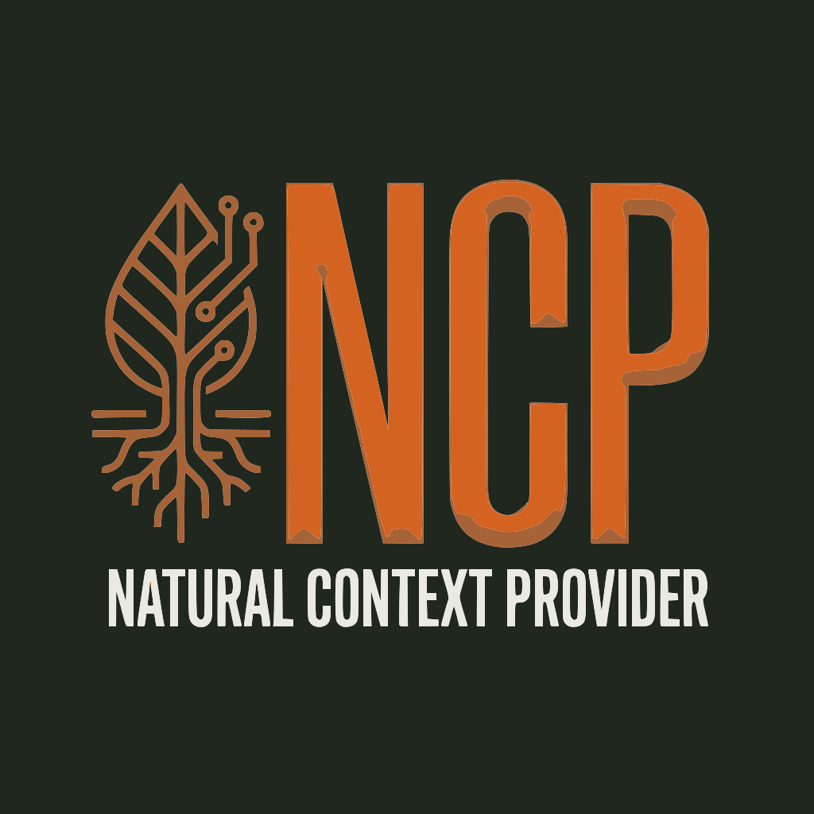
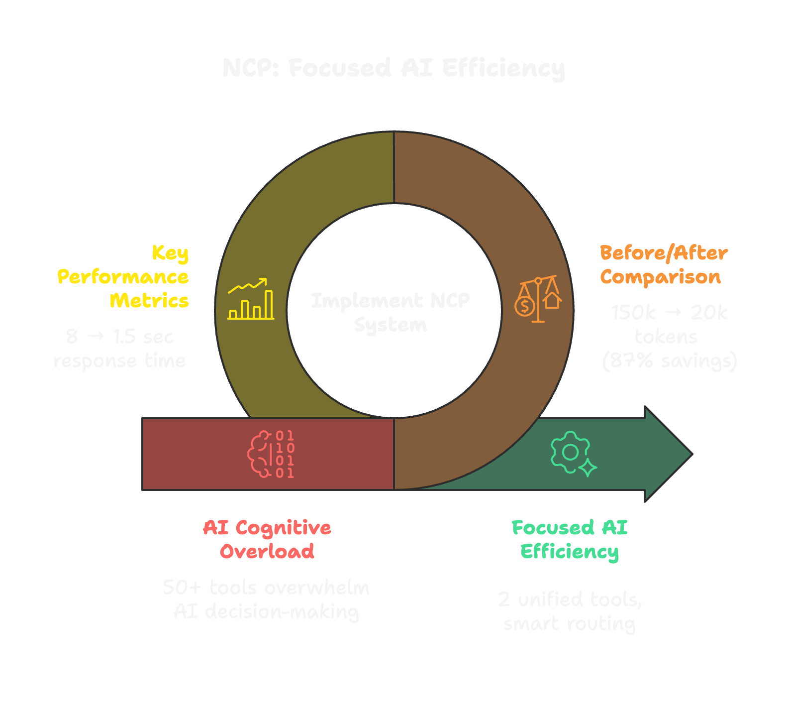
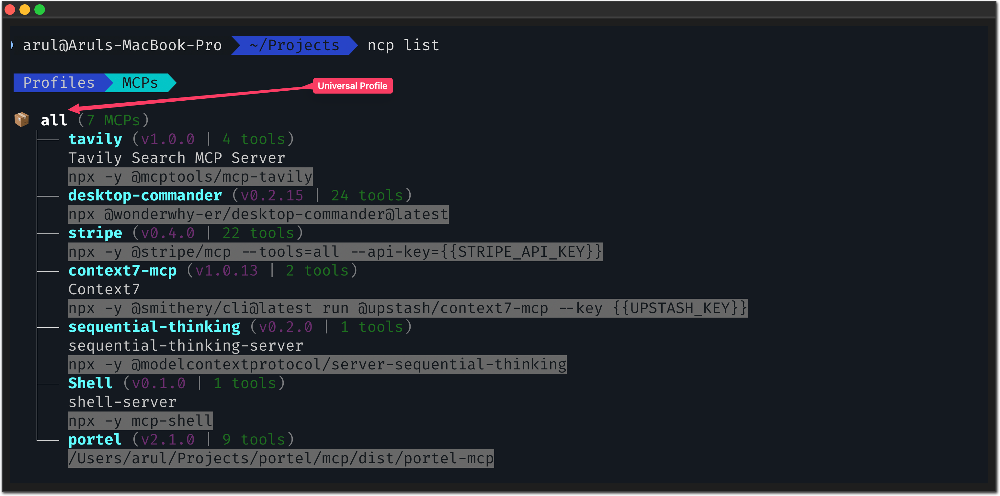
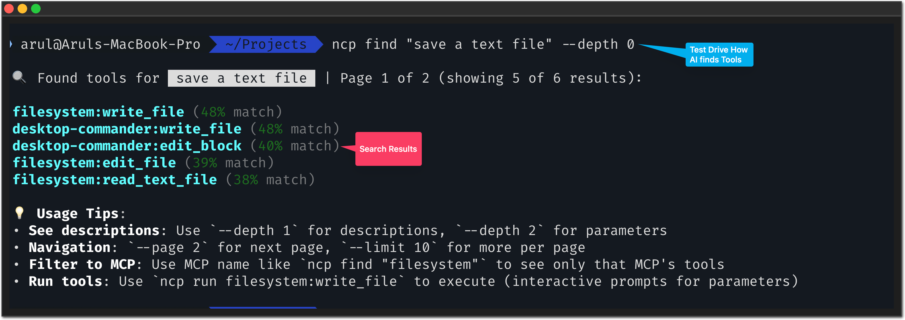
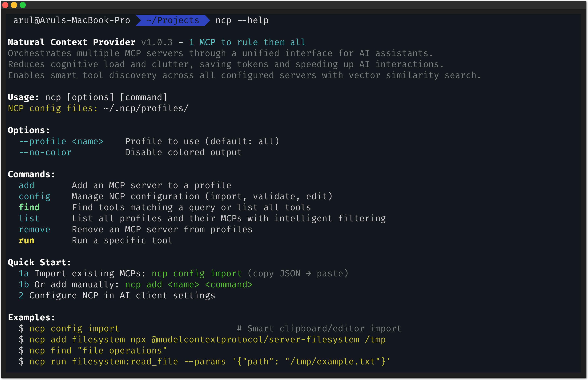
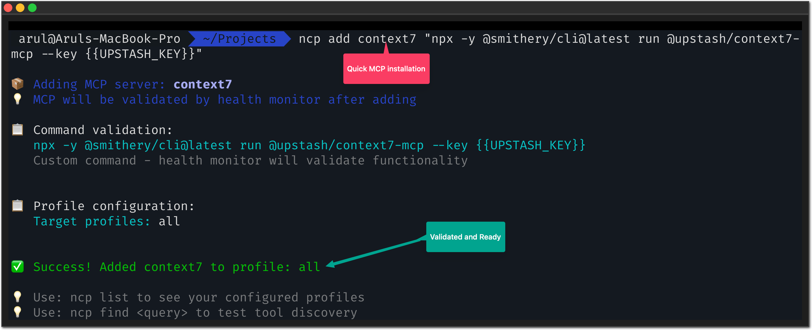

[](https://www.npmjs.com/package/@portel/ncp)
[](https://www.npmjs.com/package/@portel/ncp)
[](https://github.com/portel-dev/ncp/releases)
[](https://github.com/portel-dev/ncp/releases/latest)
[](https://www.elastic.co/licensing/elastic-license)
[](https://modelcontextprotocol.io/)

<!-- mcp-name: io.github.portel-dev/ncp -->

<div align="center">



# NCP - Natural Context Provider

> **1 MCP to rule them all**

</div>

Your MCPs, [supercharged](#-supercharged-features). Find any tool instantly, execute with code mode, run on schedule, discover skills, load Photons, ready for any client. Smart loading saves tokens and energy.

## 💍 **What is NCP?**

Instead of your AI juggling 50+ tools scattered across different MCPs, NCP gives it a single, unified interface with **code mode execution, scheduling, skills discovery, and custom Photons**.

Your AI sees just **2-3 simple tools:**
- **`find`** - Search for any tool, skill, or Photon: "I need to read a file" → finds the right tool automatically
- **`code`** - Execute TypeScript directly: `await github.create_issue({...})` (code mode, enabled by default)
- **`run`** - Execute tools individually (when code mode is disabled)

Behind the scenes, NCP manages all 50+ tools + skills + Photons: routing requests, discovering the right capability, executing code, scheduling tasks, managing health, and caching responses.



**Why this matters:**
- Your AI stops analyzing "which tool do I use?" and starts doing actual work
- **Code mode** lets AI write multi-step TypeScript workflows combining tools, skills, and scheduling
- **Skills** provide domain expertise: canvas design, PDF manipulation, document generation, more
- **Photons** enable custom TypeScript MCPs without npm publishing
- **97% fewer tokens burned** on tool confusion (2,500 vs 103,000 for 80 tools)
- **5x faster responses** (sub-second tool selection vs 5-8 seconds)
- **Your AI becomes focused.** Not desperate.

🚀 **NEW:** Project-level configuration - each project can define its own MCPs automatically

> **What's MCP?** The [Model Context Protocol](https://modelcontextprotocol.io) by Anthropic lets AI assistants connect to external tools and data sources. Think of MCPs as "plugins" that give your AI superpowers like file access, web search, databases, and more.

---

## 📑 **Quick Navigation**

- [The Problem](#-the-mcp-paradox-from-assistant-to-desperate) - Why too many tools break your AI
- [The Solution](#-the-before--after-reality) - How NCP transforms your experience
- [Getting Started](#-prerequisites) - Installation & quick start
- [Try It Out](#-test-drive-see-the-difference-yourself) - See the CLI in action
- [Supercharged Features](#-supercharged-features) - How NCP empowers your MCPs
- [Setup by Client](#️-configuration-for-different-ai-clients) - Claude Desktop, Cursor, VS Code, etc.
- [Popular MCPs](#-popular-mcps-that-work-great-with-ncp) - Community favorites to add
- [Advanced Features](#-advanced-features) - Project config, scheduling, remote MCPs
- [Troubleshooting](#-troubleshooting) - Common issues & solutions
- [How It Works](#-deep-dive-how-it-works) - Technical deep dive
- [Contributing](#-contributing) - Help us improve NCP

---

## 😤 **The MCP Paradox: From Assistant to Desperate**

You gave your AI assistant 50 tools to be more capable. Instead, you got desperation:

- **Paralyzed by choice** ("Should I use `read_file` or `get_file_content`?")
- **Exhausted before starting** ("I've spent my context limit analyzing which tool to use")
- **Costs explode** (50+ tool schemas burn tokens before any real work happens)
- **Asks instead of acts** (used to be decisive, now constantly asks for clarification)

---

## 🧸 **Why Too Many Tools Break the System**

Think about it like this:

**A child with one toy** → Treasures it, masters it, creates endless games with it
**A child with 50 toys** → Can't hold them all, gets overwhelmed, stops playing entirely

**Your AI is that child.** MCPs are the toys. More isn't always better.

The most creative people thrive with **constraints**, not infinite options. A poet given "write about anything" faces writer's block. Given "write a haiku about rain"? Instant inspiration.

**Your AI is the same.** Give it one perfect tool → Instant action. Give it 50 tools → Cognitive overload. NCP provides just-in-time tool discovery so your AI gets exactly what it needs, when it needs it.

---

## 📊 **The Before & After Reality**

### **Before NCP: Desperate Assistant** 😵‍💫

When your AI assistant manages 50 tools directly:

```
🤖 AI Assistant Context:
├── Filesystem MCP (12 tools) ─ 15,000 tokens
├── Database MCP (8 tools) ─── 12,000 tokens
├── Web Search MCP (6 tools) ── 8,000 tokens
├── Email MCP (15 tools) ───── 18,000 tokens
├── Shell MCP (10 tools) ───── 14,000 tokens
├── GitHub MCP (20 tools) ──── 25,000 tokens
└── Slack MCP (9 tools) ────── 11,000 tokens

💀 Total: 80 tools = 103,000 tokens of schemas
```

**What happens:**
- AI burns 50%+ of context just understanding what tools exist
- Spends 5-8 seconds analyzing which tool to use
- Often picks wrong tool due to schema confusion
- Hits context limits mid-conversation

### **After NCP: Executive Assistant** ✨

With NCP as Chief of Staff:

```
🤖 AI Assistant Context:
└── NCP (2 unified tools) ──── 2,500 tokens

🎯 Behind the scenes: NCP manages all 80 tools
📈 Context saved: 100,500 tokens (97% reduction!)
⚡ Decision time: Sub-second tool selection
🎪 AI behavior: Confident, focused, decisive
```

**Real results from our testing:**

| Your MCP Setup | Without NCP | With NCP | Token Savings |
|----------------|-------------|----------|---------------|
| **Small** (5 MCPs, 25 tools) | 15,000 tokens | 8,000 tokens | **47% saved** |
| **Medium** (15 MCPs, 75 tools) | 45,000 tokens | 12,000 tokens | **73% saved** |
| **Large** (30 MCPs, 150 tools) | 90,000 tokens | 15,000 tokens | **83% saved** |
| **Enterprise** (50+ MCPs, 250+ tools) | 150,000 tokens | 20,000 tokens | **87% saved** |

**Translation:**
- **5x faster responses** (8 seconds → 1.5 seconds)
- **12x longer conversations** before hitting limits
- **90% reduction** in wrong tool selection
- **Zero context exhaustion** in typical sessions

---

## 📋 **Prerequisites**

- **Node.js 18+** ([Download here](https://nodejs.org/))
- **npm** (included with Node.js) or **npx** for running packages
- **Command line access** (Terminal on Mac/Linux, Command Prompt/PowerShell on Windows)

## 🚀 **Installation**

Choose your MCP client for setup instructions:

| Client | Description | Setup Guide |
|--------|-------------|-------------|
| **Claude Desktop** | Anthropic's official desktop app. **Best for NCP** - one-click .dxt install with auto-sync | **[→ Full Guide](docs/clients/claude-desktop.md)** |
| **Claude Code** | Terminal-first AI workflow. Works out of the box! | Built-in support |
| **VS Code** | GitHub Copilot with Agent Mode. Use NCP for semantic tool discovery | **[→ Setup](docs/clients/vscode.md)** |
| **Cursor** | AI-first code editor with Composer. Popular VS Code alternative | **[→ Setup](docs/clients/cursor.md)** |
| **Windsurf** | Codeium's AI-native IDE with Cascade. Built on VS Code | **[→ Setup](docs/clients/windsurf.md)** |
| **Cline** | VS Code extension for AI-assisted development with MCP support | **[→ Setup](docs/clients/cline.md)** |
| **Continue** | VS Code AI assistant with Agent Mode and local LLM support | **[→ Setup](docs/clients/continue.md)** |
| **Want more clients?** | See the full list of MCP-compatible clients and tools | [Official MCP Clients](https://github.com/modelcontextprotocol/servers#clients) • [Awesome MCP](https://github.com/punkpeye/awesome-mcp) |
| **Other Clients** | Any MCP-compatible client via npm | [Quick Start ↓](#quick-start-npm) |

---

### Quick Start (npm)

For advanced users or MCP clients not listed above:

**Step 1: Install NCP**
```bash
npm install -g @portel/ncp
```

**Step 2: Import existing MCPs (optional)**
```bash
ncp config import  # Paste your config JSON when prompted
```

**Step 3: Configure your MCP client**

Add to your client's MCP configuration:
```json
{
  "mcpServers": {
    "ncp": {
      "command": "ncp"
    }
  }
}
```

**✅ Done!** Your AI now sees just 2 tools instead of 50+.



---

## 🧪 **Test Drive: See the Difference Yourself**

Want to experience what your AI experiences? NCP has a human-friendly CLI:

### **🔍 Smart Discovery**
```bash
# Ask like your AI would ask:
ncp find "I need to read a file"
ncp find "help me send an email"
ncp find "search for something online"
```



**Notice:** NCP understands intent, not just keywords. Just like your AI needs.

### **📋 Ecosystem Overview**
```bash
# See your complete MCP ecosystem:
ncp list --depth 2

# Get help anytime:
ncp --help
```



### **⚡ Direct Testing**
```bash
# Test any tool safely:
ncp run filesystem read_file --path "/tmp/test.txt"
```

**Why this matters:** You can debug and test tools directly, just like your AI would use them.

### **✅ Verify Everything Works**

```bash
# 1. Check NCP is installed correctly
ncp --version

# 2. Confirm your MCPs are imported
ncp list

# 3. Test tool discovery
ncp find "file"

# 4. Test a simple tool (if you have filesystem MCP)
ncp run filesystem read_file --path "/tmp/test.txt" --dry-run
```

**✅ Success indicators:**
- NCP shows version number
- `ncp list` shows your imported MCPs
- `ncp find` returns relevant tools
- Your AI client shows only NCP in its tool list

---

## 💪 **From Tools to Automation: The Real Power**

You've seen `find` (discover tools) and `code` (execute TypeScript). Individually, they're useful. **Together with scheduling, they become an automation powerhouse.**

### A Real Example: The MCP Conference Scraper

We wanted to stay on top of MCP-related conferences and workshops for an upcoming release. Instead of manually checking websites daily, we asked Claude:

> "Set up a daily scraper that finds MCP conferences and saves them to a CSV file"

**What Claude did:**

1. **Used `code` to write the automation:**
   ```typescript
   // Search the web for MCP conferences
   const results = await web.search({
     query: "Model Context Protocol conference 2025"
   });

   // Read each result and extract details
   for (const url of results) {
     const content = await web.read({ url });
     // Extract title, deadline, description...
     // Save to ~/.ncp/mcp-conferences.csv
   }
   ```

2. **Used `schedule` to automate it:**
   ```bash
   ncp schedule create code:run "every day at 9am" \
     --name "MCP Conference Scraper" \
     --catchup-missed
   ```

**How to set this up yourself:**

First, install the web photon (provides search and read capabilities):
```bash
# Install from the official photons repo
ncp photon add https://raw.githubusercontent.com/portel-dev/photons/main/web.photon.ts
```

Then ask Claude to create the scraper - it will use the web photon automatically.

**What happens now:**
- Every morning at 9am, the scraper runs automatically
- Searches for new MCP events and adds them to the CSV
- If our laptop was closed at 9am, it catches up when we open it
- We wake up to fresh conference data - no manual work

**The insight:** `find` and `code` let AI write automation. `schedule` makes it run forever. That's the powerhouse.

---

## 💡 **Why NCP Transforms Your AI Experience**

### **🧠 From Desperation to Delegation**
- **Desperate Assistant:** "I see 50 tools... which should I use... let me think..."
- **Executive Assistant:** "I need file access. Done." *(NCP handles the details)*

### **💰 Massive Token Savings**
- **Before:** 100k+ tokens burned on tool confusion
- **After:** 2.5k tokens for focused execution
- **Result:** 40x token efficiency = 40x longer conversations

### **🎯 Eliminates Choice Paralysis**
- **Desperate:** AI freezes, picks wrong tool, asks for clarification
- **Executive:** NCP's Chief of Staff finds the RIGHT tool instantly

### **🚀 Confident Action**
- **Before:** 8-second delays, hesitation, "Which tool should I use?"
- **After:** Instant decisions, immediate execution, zero doubt

**Bottom line:** Your AI goes from desperate assistant to **executive assistant**.

---

## ⚡ **Supercharged Features**

Here's exactly how NCP empowers your MCPs:

| Feature | What It Does | Why It Matters |
|---------|-------------|----------------|
| **🔍 Instant Tool Discovery** | Semantic search understands intent ("read a file") not just keywords | Your AI finds the RIGHT tool in <1s instead of analyzing 50 schemas |
| **📦 On-Demand Loading** | MCPs and tools load only when needed, not at startup | Saves 97% of context tokens - AI starts working immediately |
| **⏰ Automated Scheduling** | Run any tool on cron schedules or natural language times | Background automation without keeping AI sessions open |
| **🔌 Universal Compatibility** | Works with Claude Desktop, Claude Code, Cursor, VS Code, and any MCP client | One configuration for all your AI tools - no vendor lock-in |
| **💾 Smart Caching** | Intelligent caching of tool schemas and responses | Eliminates redundant indexing - energy efficient and fast |

**The result:** Your MCPs go from scattered tools to a **unified, intelligent system** that your AI can actually use effectively.

---

## 🛠️ **For Power Users: Manual Setup**

Prefer to build from scratch? Add MCPs manually:

```bash
# Add the most popular MCPs:

# AI reasoning and memory
ncp add sequential-thinking npx @modelcontextprotocol/server-sequential-thinking
ncp add memory npx @modelcontextprotocol/server-memory

# File and development tools
ncp add filesystem npx @modelcontextprotocol/server-filesystem ~/Documents  # Path: directory to access
ncp add github npx @modelcontextprotocol/server-github                       # No path needed

# Search and productivity
ncp add brave-search npx @modelcontextprotocol/server-brave-search           # No path needed
```



**💡 Pro tip:** Browse [Smithery.ai](https://smithery.ai) (2,200+ MCPs) or [mcp.so](https://mcp.so) to discover tools for your specific needs.

---

## 🎯 **Popular MCPs That Work Great with NCP**

### **🔥 Most Downloaded**
```bash
# Community favorites (download counts from Smithery.ai):
ncp add sequential-thinking npx @modelcontextprotocol/server-sequential-thinking  # 5,550+ downloads
ncp add memory npx @modelcontextprotocol/server-memory                            # 4,200+ downloads
ncp add brave-search npx @modelcontextprotocol/server-brave-search                # 680+ downloads
```

### **🛠️ Development Essentials**
```bash
# Popular dev tools:
ncp add filesystem npx @modelcontextprotocol/server-filesystem ~/code
ncp add github npx @modelcontextprotocol/server-github
ncp add shell npx @modelcontextprotocol/server-shell
```

### **🌐 Productivity & Integrations**
```bash
# Enterprise favorites:
ncp add gmail npx @mcptools/gmail-mcp
ncp add slack npx @modelcontextprotocol/server-slack
ncp add google-drive npx @modelcontextprotocol/server-gdrive
ncp add postgres npx @modelcontextprotocol/server-postgres
ncp add puppeteer npx @hisma/server-puppeteer
```


## 🤖 **Internal MCPs**

NCP includes powerful internal MCPs that extend functionality beyond external tool orchestration:

### **Scheduler MCP** - Automate Any Tool
Schedule any MCP tool to run automatically using cron or natural language schedules.

```bash
# Schedule a daily backup check
ncp run schedule:create --params '{
  "name": "Daily Backup",
  "schedule": "every day at 2am",
  "tool": "filesystem:list_directory",
  "parameters": {"path": "/backups"}
}'
```

**Features:**
- ✅ Natural language schedules ("every day at 9am", "every monday")
- ✅ Standard cron expressions for advanced control
- ✅ Automatic validation before scheduling
- ✅ Execution history and monitoring
- ✅ Works even when NCP is not running (system cron integration)

**[→ Full Scheduler Guide](docs/SCHEDULER_USER_GUIDE.md)**

### **MCP Management MCP** - Install MCPs from AI
Install and configure MCPs dynamically through natural language.

```bash
# AI can discover and install MCPs for you
ncp find "install mcp"
# Shows: mcp:add, mcp:remove, mcp:list
```

**Features:**
- ✅ Search and discover MCPs from registries
- ✅ Install MCPs without manual configuration
- ✅ Update and remove MCPs programmatically
- ✅ AI can self-extend with new capabilities

### **Skills Management MCP** - Extend Claude with Plugins

Manage Anthropic Agent Skills - modular extensions that add specialized knowledge and tools to Claude.

```typescript
// Discover skills using vector search
const results = await skills.find({ query: "canvas design" });

// Install a skill
await skills.add({ skill_name: "canvas-design" });

// List installed skills
const installed = await skills.list();

// Read skill resources
const template = await skills.read_resource({
  skill_name: "canvas-design",
  file_path: "resources/templates.md"
});
```

**Features:**
- ✅ Vector-powered semantic search for skills
- ✅ One-command install from official marketplace
- ✅ Progressive disclosure (metadata → full content → resources)
- ✅ Official Anthropic marketplace integration
- ✅ Custom marketplace support
- ✅ Auto-loading of installed skills

**[→ Full Skills Guide](./SKILLS.md)**

### **Analytics MCP** - Visualize Usage & Performance
View usage statistics, token savings, and performance metrics directly in your chat.

```bash
# View usage overview with ASCII charts
ncp run analytics:overview --params '{"period": 7}'
```

**Features:**
- ✅ Usage trends and most used tools
- ✅ Token savings analysis (Code-Mode efficiency)
- ✅ Performance metrics (response times, error rates)
- ✅ ASCII-formatted charts for AI consumption

**Configuration:**
Internal MCPs are disabled by default. Enable in your profile settings:

```json
{
  "settings": {
    "enable_schedule_mcp": true,
    "enable_mcp_management": true,
    "enable_skills": true,
    "enable_analytics_mcp": true
  }
}
```

---

## 🔧 **Advanced Features**

### **Smart Health Monitoring**
NCP automatically detects broken MCPs and routes around them:

```bash
ncp list --depth 1    # See health status
ncp config validate   # Check configuration health
```

**🎯 Result:** Your AI never gets stuck on broken tools.

### **Multi-Profile Organization**
Organize MCPs by project or environment:

```bash
# Development setup
ncp add --profile dev filesystem npx @modelcontextprotocol/server-filesystem ~/dev

# Production setup
ncp add --profile prod database npx production-db-server

# Use specific profile
ncp --profile dev find "file tools"
```

### **🚀 Project-Level Configuration**
**New:** Configure MCPs per project with automatic detection - perfect for teams and Cloud IDEs:

```bash
# In any project directory, create local MCP configuration:
mkdir .ncp
ncp add filesystem npx @modelcontextprotocol/server-filesystem ./
ncp add github npx @modelcontextprotocol/server-github

# NCP automatically detects and uses project-local configuration
ncp find "save file"  # Uses only project MCPs
```

**How it works:**
- 📁 **Local `.ncp` directory exists** → Uses project configuration
- 🏠 **No local `.ncp` directory** → Falls back to global `~/.ncp`
- 🎯 **Zero profile management needed** → Everything goes to default `all.json`

**Perfect for:**
- 🤖 **Claude Code projects** (project-specific MCP tooling)
- 👥 **Team consistency** (ship `.ncp` folder with your repo)
- 🔧 **Project-specific tooling** (each project defines its own MCPs)
- 📦 **Environment isolation** (no global MCP conflicts)

```bash
# Example project structures:
frontend-app/
  .ncp/profiles/all.json   # → playwright, lighthouse, browser-context
  src/

api-backend/
  .ncp/profiles/all.json   # → postgres, redis, docker, kubernetes
  server/
```

### **HTTP/SSE Transport & Hibernation Support**

NCP supports both **stdio** (local) and **HTTP/SSE** (remote) MCP servers:

**Stdio Transport** (Traditional):
```bash
# Local MCP servers running as processes
ncp add filesystem npx @modelcontextprotocol/server-filesystem ~/Documents
```

**HTTP/SSE Transport** (Remote):
```json
{
  "mcpServers": {
    "remote-mcp": {
      "url": "https://mcp.example.com/api",
      "auth": {
        "type": "bearer",
        "token": "your-token-here"
      }
    }
  }
}
```

**OAuth 2.1 with PKCE** (MCP 2025-03-26 spec):
```json
{
  "mcpServers": {
    "oauth-mcp": {
      "url": "https://mcp.example.com/api",
      "auth": {
        "type": "oauth",
        "oauth21": {
          "scopes": ["read", "write"],
          "callbackPort": 9876,
          "clientId": "optional-pre-registered-client-id",
          "clientSecret": "optional-client-secret"
        }
      }
    }
  }
}
```

**OAuth 2.1 Features:**
- ✅ **PKCE (Proof Key for Code Exchange)** - Required by OAuth 2.1 for security
- ✅ **Dynamic Client Registration (RFC 7591)** - Auto-registers if no clientId provided
- ✅ **Token Storage & Auto-Refresh** - Tokens saved to `~/.ncp/auth/` and refreshed automatically
- ✅ **Browser Authorization Flow** - Opens browser for user consent
- ✅ **Headless Fallback** - Manual code entry for servers/CI environments
- ✅ **Protected Resource Discovery (RFC 9728)** - Auto-discovers OAuth endpoints

**First-time setup flow:**
1. NCP opens browser to authorization URL
2. You grant permissions
3. Browser redirects to local callback (`http://localhost:9876`)
4. NCP exchanges code for access token (with PKCE)
5. Token saved and refreshed automatically for future requests

**🔋 Hibernation-Enabled Servers:**

NCP automatically supports hibernation-enabled MCP servers (like Cloudflare Durable Objects or Metorial):
- **Zero configuration needed** - Hibernation works transparently
- **Automatic wake-up** - Server wakes on demand when NCP makes requests
- **State preservation** - Server state is maintained across hibernation cycles
- **Cost savings** - Only pay when MCPs are actively processing requests

**How it works:**
1. Server hibernates when idle (consumes zero resources)
2. NCP sends a request → Server wakes instantly
3. Server processes request and responds
4. Server returns to hibernation after idle timeout

**Perfect for:**
- 💰 **Cost optimization** - Only pay for active processing time
- 🌐 **Cloud-hosted MCPs** - Metorial, Cloudflare Workers, serverless platforms
- ♻️ **Resource efficiency** - No idle server costs
- 🚀 **Scale to zero** - Servers automatically sleep when not needed

> **Note:** Hibernation is a server-side feature. NCP's standard HTTP/SSE client automatically works with both traditional and hibernation-enabled servers without any special configuration.

### **Photon Runtime (CLI vs DXT)**

The TypeScript Photon runtime is enabled by default, but the toggle lives in different places depending on how you run NCP:

- **CLI / npm installs:** Edit `~/.ncp/settings.json` (or run `ncp config`) and set `enablePhotonRuntime: true` or `false`. You can also override ad‑hoc with `NCP_ENABLE_PHOTON_RUNTIME=true ncp find "photon"`.
- **DXT / client bundles (Claude Desktop, Cursor, etc.):** These builds **ignore** `~/.ncp/settings.json`. Configure photons by setting the env var inside the client config:

```json
{
  "mcpServers": {
    "ncp": {
      "command": "ncp",
      "env": {
        "NCP_ENABLE_PHOTON_RUNTIME": "true"
      }
    }
  }
}
```

If you disable the photon runtime, internal MCPs continue to work, but `.photon.ts` files are ignored until you re-enable the flag.

### **Import from Anywhere**
```bash
# From clipboard (any JSON config)
ncp config import

# From specific file
ncp config import "~/my-mcp-config.json"

# From Claude Desktop (auto-detected paths)
ncp config import
```

---

## 🛟 **Troubleshooting**

### **Import Issues**
```bash
# Check what was imported
ncp list

# Validate health of imported MCPs
ncp config validate

# See detailed import logs
DEBUG=ncp:* ncp config import
```

### **AI Not Using Tools**
- **Check connection:** `ncp list` (should show your MCPs)
- **Test discovery:** `ncp find "your query"`
- **Validate config:** Ensure your AI client points to `ncp` command

### **Performance Issues**
```bash
# Check MCP health (unhealthy MCPs slow everything down)
ncp list --depth 1

# Clear cache if needed
rm -rf ~/.ncp/cache

# Monitor with debug logs
DEBUG=ncp:* ncp find "test"
```

---

## 🌓 **Why We Built This**

**Like Yin and Yang, everything relies on the balance of things.**

**Compute** gives us precision and certainty.
**AI** gives us creativity and probability.

We believe breakthrough products emerge when you combine these forces in the right ratio.

**How NCP embodies this balance:**

| What NCP Does | AI (Creativity) | Compute (Precision) | The Balance |
|---------------|-----------------|---------------------|-------------|
| **Tool Discovery** | Understands "read a file" semantically | Routes to exact tool deterministically | Natural request → Precise execution |
| **Orchestration** | Flexible to your intent | Reliable tool execution | Natural flow → Certain outcomes |
| **Health Monitoring** | Adapts to patterns | Monitors connections, auto-failover | Smart adaptation → Reliable uptime |

Neither pure AI (too unpredictable) nor pure compute (too rigid).

Your AI stays creative. NCP handles the precision.

---

## 📚 **Deep Dive: How It Works**

Want the technical details? Token analysis, architecture diagrams, and performance benchmarks:

📖 **[Read the Technical Guide →](HOW-IT-WORKS.md)**

Learn about:
- Vector similarity search algorithms
- N-to-1 orchestration architecture
- Real-world token usage comparisons
- Health monitoring and failover systems

---

## 🤝 **Contributing**

Help make NCP even better:

- 🐛 **Bug reports:** [GitHub Issues](https://github.com/portel-dev/ncp/issues)
- 💡 **Feature requests:** [GitHub Discussions](https://github.com/portel-dev/ncp/discussions)
- 🔄 **Pull requests:** [Contributing Guide](CONTRIBUTING.md)

---

## 📄 **License**

Elastic License 2.0 - [Full License](LICENSE)

**TLDR:** Free for all use including commercial. Cannot be offered as a hosted service to third parties.

## Hosted deployment

A hosted deployment is available on [Fronteir AI](https://fronteir.ai/mcp/portel-dev-ncp).

