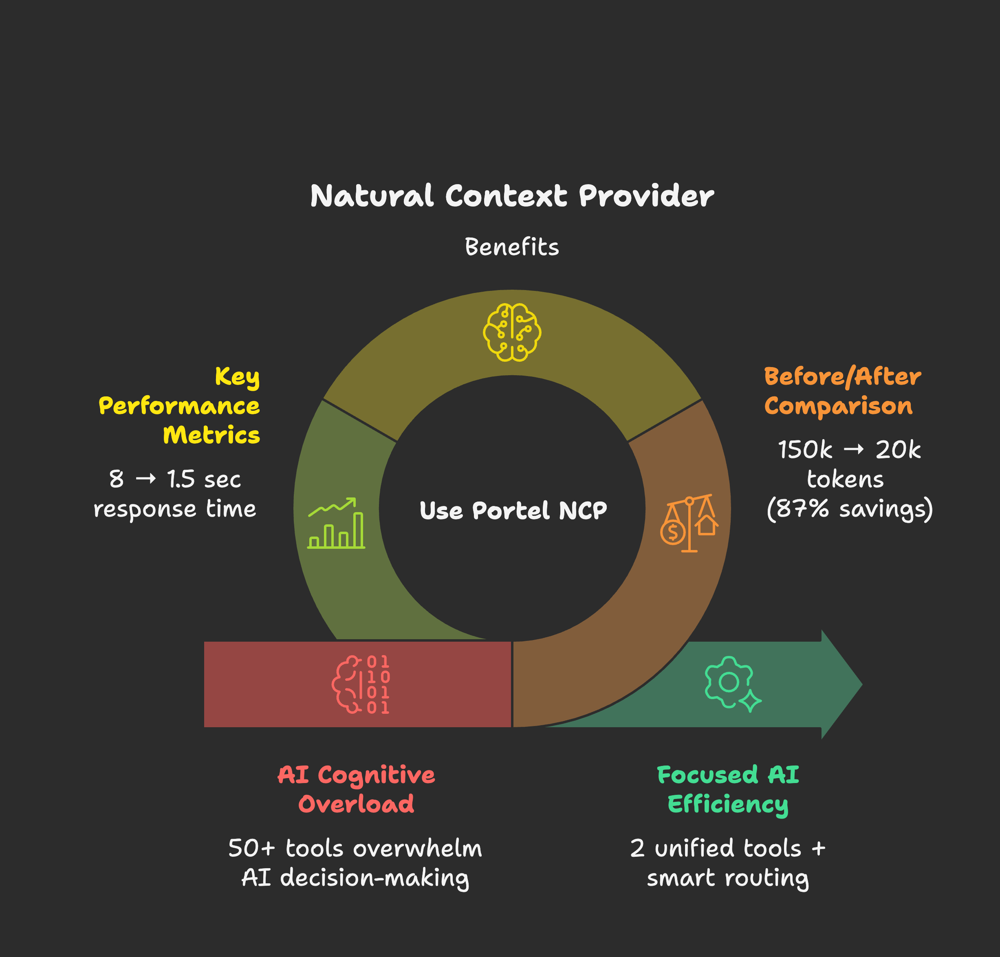

[](https://www.npmjs.com/package/@portel/ncp)
[](https://www.npmjs.com/package/@portel/ncp)
[](https://github.com/portel-dev/ncp/releases)
[](https://github.com/portel-dev/ncp/releases/latest)
[](https://www.elastic.co/licensing/elastic-license)
[](https://modelcontextprotocol.io/)

<!-- mcp-name: io.github.portel-dev/ncp -->

# NCP - Natural Context Provider

> **1 MCP to rule them all**

Your MCPs, [supercharged](#supercharged-features). [Find any tool instantly](#instant-tool-discovery), [load on demand](#on-demand-loading), [run on schedule](#automated-scheduling), [ready for any client](#universal-compatibility). [Smart loading](#smart-caching) saves tokens and energy.

## 💍 **What is NCP?**

Instead of your AI juggling 50+ tools scattered across different MCPs, NCP gives it a single, unified interface.

Your AI sees just **2 simple tools:**
- **`find`** - "I need to read a file" → finds the right tool automatically
- **`run`** - Execute any tool you discovered

Behind the scenes, NCP manages all 50+ tools: routing requests, discovering the right tool, caching responses, monitoring health.



**Why this matters:**
- Your AI stops analyzing "which tool do I use?" and starts doing actual work
- **97% fewer tokens burned** on tool confusion (2,500 vs 103,000 for 80 tools)
- **5x faster responses** (sub-second tool selection vs 5-8 seconds)
- **Your AI becomes focused.** Not desperate.

🚀 **NEW:** Project-level configuration - each project can define its own MCPs automatically

> **What's MCP?** The [Model Context Protocol](https://modelcontextprotocol.io) by Anthropic lets AI assistants connect to external tools and data sources. Think of MCPs as "plugins" that give your AI superpowers like file access, web search, databases, and more.

---

## 📑 **Quick Navigation**

- [The Problem](#the-mcp-paradox-from-assistant-to-desperate) - Why too many tools break your AI
- [The Solution](#the-before--after-reality) - How NCP transforms your experience
- [Getting Started](#prerequisites) - Installation & quick start
- [Try It Out](#test-drive-see-the-difference-yourself) - See the CLI in action
- [Supercharged Features](#supercharged-features) - How NCP empowers your MCPs
- [Setup by Client](#configuration-for-different-ai-clients) - Claude Desktop, Cursor, VS Code, etc.
- [Popular MCPs](#popular-mcps-that-work-great-with-ncp) - Community favorites to add
- [Advanced Features](#advanced-features) - Project config, scheduling, remote MCPs
- [Troubleshooting](#troubleshooting) - Common issues & solutions
- [How It Works](#deep-dive-how-it-works) - Technical deep dive
- [Contributing](#contributing) - Help us improve NCP

---

## 😤 **The MCP Paradox: From Assistant to Desperate**

You gave your AI assistant 50 tools to be more capable. Instead, you got desperation:

- **Paralyzed by choice** ("Should I use `read_file` or `get_file_content`?")
- **Exhausted before starting** ("I've spent my context limit analyzing which tool to use")
- **Costs explode** (50+ tool schemas burn tokens before any real work happens)
- **Asks instead of acts** (used to be decisive, now constantly asks for clarification)

---

## 🧸 **Why Too Many Toys Break the Fun**

Think about it:

**A child with one toy** → Treasures it, masters it, creates endless games with it

**A child with 50 toys** → Can't hold them all, loses pieces, gets overwhelmed, stops playing entirely

**Your AI is that child.** MCPs are the toys. More isn't always better.

Or picture this: You're **craving pizza**. Someone hands you a pizza → Pure joy! 🍕

But take you to a **buffet with 200 dishes** → Analysis paralysis. You spend 20 minutes deciding, lose your appetite, leave unsatisfied.

**Same with your AI:** Give it one perfect tool → Instant action. Give it 50 tools → Cognitive overload.

The most creative people thrive with **constraints**, not infinite options. Your AI is no different.

**Think about it:**
- A poet with "write about anything" → Writer's block
- A poet with "write a haiku about rain" → Instant inspiration

- A developer with access to "all programming languages" → Analysis paralysis
- A developer with "Python for this task" → Focused solution

**Your AI needs the same focus.** NCP gives it constraints that spark creativity, not chaos that kills it.

---

## 📊 **The Before & After Reality**

### **Before NCP: Desperate Assistant** 😵‍💫

When your AI assistant manages 50 tools directly:

```
🤖 AI Assistant Context:
├── Filesystem MCP (12 tools) ─ 15,000 tokens
├── Database MCP (8 tools) ─── 12,000 tokens
├── Web Search MCP (6 tools) ── 8,000 tokens
├── Email MCP (15 tools) ───── 18,000 tokens
├── Shell MCP (10 tools) ───── 14,000 tokens
├── GitHub MCP (20 tools) ──── 25,000 tokens
└── Slack MCP (9 tools) ────── 11,000 tokens

💀 Total: 80 tools = 103,000 tokens of schemas
```

**What happens:**
- AI burns 50%+ of context just understanding what tools exist
- Spends 5-8 seconds analyzing which tool to use
- Often picks wrong tool due to schema confusion
- Hits context limits mid-conversation

### **After NCP: Executive Assistant** ✨

With NCP as Chief of Staff:

```
🤖 AI Assistant Context:
└── NCP (2 unified tools) ──── 2,500 tokens

🎯 Behind the scenes: NCP manages all 80 tools
📈 Context saved: 100,500 tokens (97% reduction!)
⚡ Decision time: Sub-second tool selection
🎪 AI behavior: Confident, focused, decisive
```

**Real results from our testing:**

| Your MCP Setup | Without NCP | With NCP | Token Savings |
|----------------|-------------|----------|---------------|
| **Small** (5 MCPs, 25 tools) | 15,000 tokens | 8,000 tokens | **47% saved** |
| **Medium** (15 MCPs, 75 tools) | 45,000 tokens | 12,000 tokens | **73% saved** |
| **Large** (30 MCPs, 150 tools) | 90,000 tokens | 15,000 tokens | **83% saved** |
| **Enterprise** (50+ MCPs, 250+ tools) | 150,000 tokens | 20,000 tokens | **87% saved** |

**Translation:**
- **5x faster responses** (8 seconds → 1.5 seconds)
- **12x longer conversations** before hitting limits
- **90% reduction** in wrong tool selection
- **Zero context exhaustion** in typical sessions

---

## 📋 **Prerequisites**

- **Node.js 18+** ([Download here](https://nodejs.org/))
- **npm** (included with Node.js) or **npx** for running packages
- **Command line access** (Terminal on Mac/Linux, Command Prompt/PowerShell on Windows)

## 🚀 **Installation**

Choose your MCP client for detailed installation instructions:

| Client | Installation Guide | Best For |
|--------|-------------------|----------|
| **Claude Desktop** | **[→ Full Guide](docs/clients/claude-desktop.md)** | One-click .dxt install with auto-sync |
| **Claude Code** | Works out of the box! | Terminal-first AI workflows |
| **Cursor** | Coming soon | Code editor with AI |
| **VS Code** | Coming soon | GitHub Copilot + MCPs |
| **Cline** | Coming soon | VS Code AI extension |
| **Continue** | Coming soon | VS Code AI assistant |
| **Other Clients** | [Quick Start ↓](#quick-start-npm) | Any MCP-compatible client |

---

### Quick Start (npm) {#quick-start-npm}

For advanced users or MCP clients not listed above:

**Step 1: Install NCP**
```bash
npm install -g @portel/ncp
```

**Step 2: Import existing MCPs (optional)**
```bash
ncp config import  # Paste your config JSON when prompted
```

**Step 3: Configure your client**

Replace your MCP configuration with:
```json
{
  "mcpServers": {
    "ncp": {
      "command": "ncp"
    }
  }
}
```

**✅ Done!** Your AI now sees just 2 tools instead of 50+.


---

## 🧪 **Test Drive: See the Difference Yourself**

Want to experience what your AI experiences? NCP has a human-friendly CLI:

### **🔍 Smart Discovery**
```bash
# Ask like your AI would ask:
ncp find "I need to read a file"
ncp find "help me send an email"
ncp find "search for something online"
```


**Notice:** NCP understands intent, not just keywords. Just like your AI needs.

### **📋 Ecosystem Overview**
```bash
# See your complete MCP ecosystem:
ncp list --depth 2

# Get help anytime:
ncp --help
```


### **⚡ Direct Testing**
```bash
# Test any tool safely:
ncp run filesystem:read_file --params '{"path": "/tmp/test.txt"}'
```

**Why this matters:** You can debug and test tools directly, just like your AI would use them.

### **✅ Verify Everything Works**

```bash
# 1. Check NCP is installed correctly
ncp --version

# 2. Confirm your MCPs are imported
ncp list

# 3. Test tool discovery
ncp find "file"

# 4. Test a simple tool (if you have filesystem MCP)
ncp run filesystem:read_file --params '{"path": "/tmp/test.txt"}' --dry-run
```

**✅ Success indicators:**
- NCP shows version number
- `ncp list` shows your imported MCPs
- `ncp find` returns relevant tools
- Your AI client shows only NCP in its tool list

---

## 💡 **Why NCP Transforms Your AI Experience**

### **🧠 From Desperation to Delegation**
- **Desperate Assistant:** "I see 50 tools... which should I use... let me think..."
- **Executive Assistant:** "I need file access. Done." *(NCP handles the details)*

### **💰 Massive Token Savings**
- **Before:** 100k+ tokens burned on tool confusion
- **After:** 2.5k tokens for focused execution
- **Result:** 40x token efficiency = 40x longer conversations

### **🎯 Eliminates Choice Paralysis**
- **Desperate:** AI freezes, picks wrong tool, asks for clarification
- **Executive:** NCP's Chief of Staff finds the RIGHT tool instantly

### **🚀 Confident Action**
- **Before:** 8-second delays, hesitation, "Which tool should I use?"
- **After:** Instant decisions, immediate execution, zero doubt

**Bottom line:** Your AI goes from desperate assistant to **executive assistant**.

---

## ⚡ **Supercharged Features**

Here's exactly how NCP empowers your MCPs:

| Feature | What It Does | Why It Matters |
|---------|-------------|----------------|
| <a id="instant-tool-discovery">**🔍 Instant Tool Discovery**</a> | Semantic search understands intent ("read a file") not just keywords | Your AI finds the RIGHT tool in <1s instead of analyzing 50 schemas |
| <a id="on-demand-loading">**📦 On-Demand Loading**</a> | MCPs and tools load only when needed, not at startup | Saves 97% of context tokens - AI starts working immediately |
| <a id="automated-scheduling">**⏰ Automated Scheduling**</a> | Run any tool on cron schedules or natural language times | Background automation without keeping AI sessions open |
| <a id="universal-compatibility">**🔌 Universal Compatibility**</a> | Works with Claude Desktop, Claude Code, Cursor, VS Code, and any MCP client | One configuration for all your AI tools - no vendor lock-in |
| <a id="smart-caching">**💾 Smart Caching**</a> | Intelligent caching of tool schemas and responses | Eliminates redundant indexing - energy efficient and fast |

**The result:** Your MCPs go from scattered tools to a **unified, intelligent system** that your AI can actually use effectively.

---

## 🛠️ **For Power Users: Manual Setup**

Prefer to build from scratch? Add MCPs manually:

```bash
# Add the most popular MCPs:

# AI reasoning and memory
ncp add sequential-thinking npx @modelcontextprotocol/server-sequential-thinking
ncp add memory npx @modelcontextprotocol/server-memory

# File and development tools
ncp add filesystem npx @modelcontextprotocol/server-filesystem ~/Documents  # Path: directory to access
ncp add github npx @modelcontextprotocol/server-github                       # No path needed

# Search and productivity
ncp add brave-search npx @modelcontextprotocol/server-brave-search           # No path needed
```


**💡 Pro tip:** Browse [Smithery.ai](https://smithery.ai) (2,200+ MCPs) or [mcp.so](https://mcp.so) to discover tools for your specific needs.

---

## 🎯 **Popular MCPs That Work Great with NCP**

### **🔥 Most Downloaded**
```bash
# Community favorites (download counts from Smithery.ai):
ncp add sequential-thinking npx @modelcontextprotocol/server-sequential-thinking  # 5,550+ downloads
ncp add memory npx @modelcontextprotocol/server-memory                            # 4,200+ downloads
ncp add brave-search npx @modelcontextprotocol/server-brave-search                # 680+ downloads
```

### **🛠️ Development Essentials**
```bash
# Popular dev tools:
ncp add filesystem npx @modelcontextprotocol/server-filesystem ~/code
ncp add github npx @modelcontextprotocol/server-github
ncp add shell npx @modelcontextprotocol/server-shell
```

### **🌐 Productivity & Integrations**
```bash
# Enterprise favorites:
ncp add gmail npx @mcptools/gmail-mcp
ncp add slack npx @modelcontextprotocol/server-slack
ncp add google-drive npx @modelcontextprotocol/server-gdrive
ncp add postgres npx @modelcontextprotocol/server-postgres
ncp add puppeteer npx @hisma/server-puppeteer
```

---

## ⚙️ **Configuration for Different AI Clients**

### **Claude Desktop** (Most Popular)

**📖 [→ Full Installation Guide](docs/clients/claude-desktop.md)** - Complete guide with .dxt installation, auto-sync, configuration options, and troubleshooting.

**Quick config snippet** (for npm installation):
```json
{
  "mcpServers": {
    "ncp": {
      "command": "ncp"
    }
  }
}
```

**📌 Important:** Restart Claude Desktop after saving the config file.

### **Claude Code**
NCP works automatically! Just run:
```bash
ncp add <your-mcps>
```

### **VS Code with GitHub Copilot**

**Settings File Location:**
- **macOS:** `~/Library/Application Support/Code/User/settings.json`
- **Windows:** `%APPDATA%\Code\User\settings.json`
- **Linux:** `~/.config/Code/User/settings.json`

Add to your VS Code `settings.json`:
```json
{
  "mcp.servers": {
    "ncp": {
      "command": "ncp"
    }
  }
}
```

**📌 Important:** Restart VS Code after saving the settings file.

> **Disclaimer:** Configuration paths and methods are accurate as of this writing. VS Code and its extensions may change these locations or integration methods. Please consult the [official VS Code documentation](https://code.visualstudio.com/docs) for the most current information.

### **Cursor IDE**
```json
{
  "mcp": {
    "servers": {
      "ncp": {
        "command": "ncp"
      }
    }
  }
}
```

> **Disclaimer:** Configuration format and location may vary by Cursor IDE version. Please refer to [Cursor's official documentation](https://cursor.sh/docs) for the most up-to-date setup instructions.

---

## 🤖 **Internal MCPs**

NCP includes powerful internal MCPs that extend functionality beyond external tool orchestration:

### **Scheduler MCP** - Automate Any Tool
Schedule any MCP tool to run automatically using cron or natural language schedules.

```bash
# Schedule a daily backup check
ncp run schedule:create --params '{
  "name": "Daily Backup",
  "schedule": "every day at 2am",
  "tool": "filesystem:list_directory",
  "parameters": {"path": "/backups"}
}'
```

**Features:**
- ✅ Natural language schedules ("every day at 9am", "every monday")
- ✅ Standard cron expressions for advanced control
- ✅ Automatic validation before scheduling
- ✅ Execution history and monitoring
- ✅ Works even when NCP is not running (system cron integration)

**[→ Full Scheduler Guide](docs/SCHEDULER_USER_GUIDE.md)**

### **MCP Management MCP** - Install MCPs from AI
Install and configure MCPs dynamically through natural language.

```bash
# AI can discover and install MCPs for you
ncp find "install mcp"
# Shows: mcp:install, mcp:search, mcp:configure
```

**Features:**
- ✅ Search and discover MCPs from registries
- ✅ Install MCPs without manual configuration
- ✅ Update and remove MCPs programmatically
- ✅ AI can self-extend with new capabilities

**Configuration:**
Internal MCPs are disabled by default. Enable in your profile settings:

```json
{
  "settings": {
    "enable_schedule_mcp": true,
    "enable_mcp_management": true
  }
}
```

---

## 🔧 **Advanced Features**

### **Smart Health Monitoring**
NCP automatically detects broken MCPs and routes around them:

```bash
ncp list --depth 1    # See health status
ncp config validate   # Check configuration health
```

**🎯 Result:** Your AI never gets stuck on broken tools.

### **Multi-Profile Organization**
Organize MCPs by project or environment:

```bash
# Development setup
ncp add --profile dev filesystem npx @modelcontextprotocol/server-filesystem ~/dev

# Production setup
ncp add --profile prod database npx production-db-server

# Use specific profile
ncp --profile dev find "file tools"
```

### **🚀 Project-Level Configuration**
**New:** Configure MCPs per project with automatic detection - perfect for teams and Cloud IDEs:

```bash
# In any project directory, create local MCP configuration:
mkdir .ncp
ncp add filesystem npx @modelcontextprotocol/server-filesystem ./
ncp add github npx @modelcontextprotocol/server-github

# NCP automatically detects and uses project-local configuration
ncp find "save file"  # Uses only project MCPs
```

**How it works:**
- 📁 **Local `.ncp` directory exists** → Uses project configuration
- 🏠 **No local `.ncp` directory** → Falls back to global `~/.ncp`
- 🎯 **Zero profile management needed** → Everything goes to default `all.json`

**Perfect for:**
- 🤖 **Claude Code projects** (project-specific MCP tooling)
- 👥 **Team consistency** (ship `.ncp` folder with your repo)
- 🔧 **Project-specific tooling** (each project defines its own MCPs)
- 📦 **Environment isolation** (no global MCP conflicts)

```bash
# Example project structures:
frontend-app/
  .ncp/profiles/all.json   # → playwright, lighthouse, browser-context
  src/

api-backend/
  .ncp/profiles/all.json   # → postgres, redis, docker, kubernetes
  server/
```

### **HTTP/SSE Transport & Hibernation Support**

NCP supports both **stdio** (local) and **HTTP/SSE** (remote) MCP servers:

**Stdio Transport** (Traditional):
```bash
# Local MCP servers running as processes
ncp add filesystem npx @modelcontextprotocol/server-filesystem ~/Documents
```

**HTTP/SSE Transport** (Remote):
```json
{
  "mcpServers": {
    "remote-mcp": {
      "url": "https://mcp.example.com/api",
      "auth": {
        "type": "bearer",
        "token": "your-token-here"
      }
    }
  }
}
```

**🔋 Hibernation-Enabled Servers:**

NCP automatically supports hibernation-enabled MCP servers (like Cloudflare Durable Objects or Metorial):
- **Zero configuration needed** - Hibernation works transparently
- **Automatic wake-up** - Server wakes on demand when NCP makes requests
- **State preservation** - Server state is maintained across hibernation cycles
- **Cost savings** - Only pay when MCPs are actively processing requests

**How it works:**
1. Server hibernates when idle (consumes zero resources)
2. NCP sends a request → Server wakes instantly
3. Server processes request and responds
4. Server returns to hibernation after idle timeout

**Perfect for:**
- 💰 **Cost optimization** - Only pay for active processing time
- 🌐 **Cloud-hosted MCPs** - Metorial, Cloudflare Workers, serverless platforms
- ♻️ **Resource efficiency** - No idle server costs
- 🚀 **Scale to zero** - Servers automatically sleep when not needed

> **Note:** Hibernation is a server-side feature. NCP's standard HTTP/SSE client automatically works with both traditional and hibernation-enabled servers without any special configuration.

### **Import from Anywhere**
```bash
# From clipboard (any JSON config)
ncp config import

# From specific file
ncp config import "~/my-mcp-config.json"

# From Claude Desktop (auto-detected paths)
ncp config import
```

---

## 🛟 **Troubleshooting**

### **Import Issues**
```bash
# Check what was imported
ncp list

# Validate health of imported MCPs
ncp config validate

# See detailed import logs
DEBUG=ncp:* ncp config import
```

### **AI Not Using Tools**
- **Check connection:** `ncp list` (should show your MCPs)
- **Test discovery:** `ncp find "your query"`
- **Validate config:** Ensure your AI client points to `ncp` command

### **Performance Issues**
```bash
# Check MCP health (unhealthy MCPs slow everything down)
ncp list --depth 1

# Clear cache if needed
rm -rf ~/.ncp/cache

# Monitor with debug logs
DEBUG=ncp:* ncp find "test"
```

---

## 🌓 **Why We Built This**

**Like Yin and Yang, everything relies on the balance of things.**

**Compute** gives us precision and certainty.
**AI** gives us creativity and probability.

We believe breakthrough products emerge when you combine these forces in the right ratio.

**How NCP embodies this balance:**

| What NCP Does | AI (Creativity) | Compute (Precision) | The Balance |
|---------------|-----------------|---------------------|-------------|
| **Tool Discovery** | Understands "read a file" semantically | Routes to exact tool deterministically | Natural request → Precise execution |
| **Orchestration** | Flexible to your intent | Reliable tool execution | Natural flow → Certain outcomes |
| **Health Monitoring** | Adapts to patterns | Monitors connections, auto-failover | Smart adaptation → Reliable uptime |

Neither pure AI (too unpredictable) nor pure compute (too rigid).

Your AI stays creative. NCP handles the precision.

---

## 📚 **Deep Dive: How It Works**

Want the technical details? Token analysis, architecture diagrams, and performance benchmarks:

📖 **[Read the Technical Guide →](HOW-IT-WORKS.md)**

Learn about:
- Vector similarity search algorithms
- N-to-1 orchestration architecture
- Real-world token usage comparisons
- Health monitoring and failover systems

---

## 🤝 **Contributing**

Help make NCP even better:

- 🐛 **Bug reports:** [GitHub Issues](https://github.com/portel-dev/ncp/issues)
- 💡 **Feature requests:** [GitHub Discussions](https://github.com/portel-dev/ncp/discussions)
- 🔄 **Pull requests:** [Contributing Guide](CONTRIBUTING.md)

---

## 📄 **License**

Elastic License 2.0 - [Full License](LICENSE)

**TLDR:** Free for all use including commercial. Cannot be offered as a hosted service to third parties.