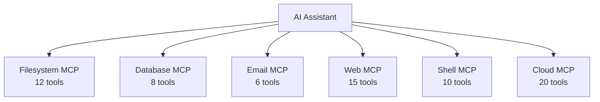
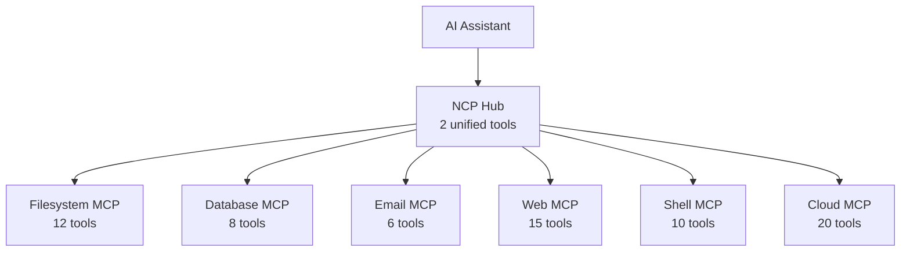
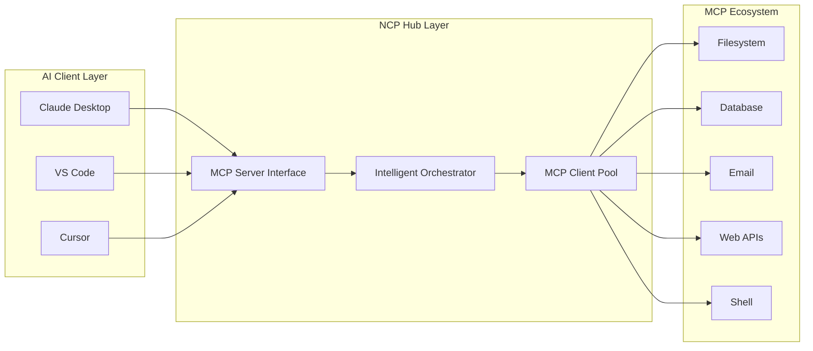
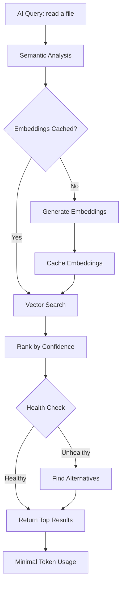
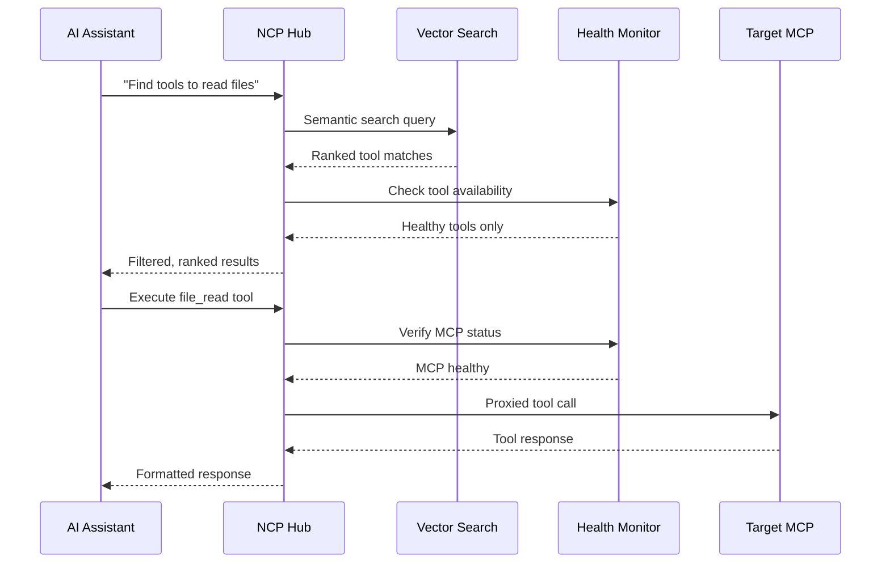

# NCP Technical Guide

## The N-to-1 Problem & Solution

### The N Problem: Cognitive Overload

When AI assistants connect directly to multiple MCP servers, they face cognitive overload:



**Problems:**
- **Schema Complexity**: Each MCP exposes 5-15+ tools with detailed schemas
- **Context Explosion**: 50+ tools = 150k+ tokens in context
- **Decision Paralysis**: AI must analyze dozens of similar tools
- **Response Delays**: 3-8 second response times due to analysis overhead

**Example**: A typical setup with filesystem, git, web, email, and database MCPs presents 71+ tool schemas to the AI simultaneously.

### The 1 Solution: N-to-1 Orchestration



NCP consolidates complexity behind a simple interface:
- **Unified Schema**: AI sees just 2 tools (`find` and `run`)
- **Smart Routing**: NCP handles tool discovery and execution
- **Context Reduction**: 150k+ tokens → 8k tokens
- **Fast Responses**: Sub-second tool selection

**Result**: N complex MCP servers → 1 simple interface. AI sees just 2 tools (`find` and `run`), NCP handles everything behind the scenes.

## Token Savings Analysis

### Real-World Measurements

| Setup Size | Tools Exposed | Context Without NCP | Context With NCP | Token Savings |
|------------|---------------|-------------------|------------------|---------------|
| **Small** (5 MCPs) | 25-30 tools | ~15,000 tokens | ~8,000 tokens | **47%** |
| **Medium** (15 MCPs) | 75-90 tools | ~45,000 tokens | ~12,000 tokens | **73%** |
| **Large** (30 MCPs) | 150+ tools | ~90,000 tokens | ~15,000 tokens | **83%** |
| **Enterprise** (50+ MCPs) | 250+ tools | ~150,000 tokens | ~20,000 tokens | **87%** |

### Why Such Massive Savings?

1. **Schema Consolidation**: 50+ detailed tool schemas → 2 simple schemas
2. **Lazy Loading**: Tools only loaded when actually needed, not preemptively
3. **Smart Caching**: Vector embeddings cached locally, no regeneration overhead
4. **Health Filtering**: Broken/unavailable tools excluded from context automatically
5. **Semantic Compression**: Natural language queries vs. formal tool specifications

## Architecture Deep Dive

### Dual Architecture: Server + Client

NCP operates as both an **MCP server** (to your AI client) and an **MCP client** (to downstream MCPs):



### Core Components

#### 1. Semantic Discovery Engine
- **Vector Embeddings**: Uses @xenova/transformers for semantic matching
- **Query Processing**: Converts natural language to tool capabilities
- **Confidence Scoring**: Ranks tools by relevance (0-1 scale)
- **Cache Management**: Persistent embeddings for fast repeated searches

```typescript
interface DiscoveryResult {
  tool: string;
  mcp: string;
  confidence: number;
  description: string;
  schema: ToolSchema;
}
```

#### 2. Intelligent Orchestrator
- **Health-Aware Routing**: Automatic failover to healthy alternatives
- **Connection Pooling**: Efficient resource management
- **Load Balancing**: Distributes requests across available MCPs
- **Error Recovery**: Graceful handling of MCP failures

#### 3. Health Monitor
- **Continuous Monitoring**: Tracks MCP server status in real-time
- **Automatic Blacklisting**: Removes unhealthy servers from routing
- **Recovery Detection**: Automatically re-enables recovered servers
- **Performance Metrics**: Latency and success rate tracking

#### 4. Connection Pool Manager
- **Lazy Loading**: MCPs only loaded when needed
- **Resource Cleanup**: Automatic connection management
- **Memory Optimization**: Efficient use of system resources
- **Concurrent Execution**: Parallel tool execution when possible

### Token Optimization Process



**Process Flow:**
1. **Request Interception**: AI sends natural language query to NCP
2. **Semantic Analysis**: Vector search finds relevant tools
3. **Health Filtering**: Only healthy MCPs included in results
4. **Schema Simplification**: Complex schemas abstracted to simple interface
5. **Response Optimization**: Minimal context returned to AI

**Result**: Instead of loading 50+ tool schemas (150k+ tokens), AI sees 2 unified tools (8k tokens) with intelligent routing behind the scenes.

## Performance Characteristics

### Response Time Improvements
- **Without NCP**: 3-8 seconds (analysis overhead)
- **With NCP**: 0.5-1.5 seconds (direct semantic search)
- **Improvement**: 3-5x faster tool selection

### Memory Usage
- **Schema Storage**: 95% reduction in AI context memory
- **Cache Efficiency**: Embeddings cached for instant retrieval
- **Resource Management**: Automatic cleanup prevents memory leaks

### Scalability
- **Horizontal**: Support for 100+ MCP servers
- **Vertical**: Efficient single-machine resource usage
- **Network**: Minimal bandwidth usage through smart caching

## Advanced Features

### Profile System
Organize MCPs by environment, project, or use case:

```json
{
  "profiles": {
    "development": {
      "stripe": { "env": { "API_KEY": "sk_test_..." } },
      "database": { "args": ["--host", "localhost"] }
    },
    "production": {
      "stripe": { "env": { "API_KEY": "sk_live_..." } },
      "database": { "args": ["--host", "prod.db.com"] }
    }
  }
}
```

### Health-Aware Execution
Automatic failover and recovery:

```typescript
interface HealthStatus {
  status: 'healthy' | 'degraded' | 'unhealthy';
  latency: number;
  successRate: number;
  lastCheck: Date;
  alternatives?: string[];
}
```

### Vector Similarity Search
Semantic tool discovery using embeddings:

```typescript
interface ToolEmbedding {
  tool: string;
  mcp: string;
  vector: number[];
  description: string;
  keywords: string[];
}
```

## Integration Patterns

### MCP Client Compatibility
NCP maintains full compatibility with:
- **Claude Desktop**: Native MCP protocol support
- **VS Code**: MCP extension integration
- **Cursor**: Built-in MCP support
- **Custom Clients**: Standard JSON-RPC 2.0 protocol

### Tool Execution Flow


1. AI sends natural language query
2. NCP performs semantic search
3. Best matching tools returned with confidence scores
4. AI selects tool and sends execution request
5. NCP routes to appropriate MCP server
6. Results returned with error handling

### Error Handling Strategy
- **Graceful Degradation**: Partial failures don't break workflow
- **Automatic Retry**: Transient failures handled transparently
- **Alternative Routing**: Backup tools suggested when primary fails
- **User Notification**: Clear error messages with actionable advice

## Security Considerations

### API Key Management
- **Environment Isolation**: Separate credentials per profile
- **No Storage**: Credentials passed through, never persisted
- **Process Isolation**: Each MCP runs in separate process

### Network Security
- **Local Communication**: All MCP communication over localhost
- **No External Calls**: NCP doesn't make external network requests
- **Process Sandboxing**: MCPs isolated from each other

### Access Control
- **Profile Permissions**: Fine-grained access control per profile
- **Tool Filtering**: Restrict access to specific tools/MCPs
- **Audit Logging**: Optional request/response logging

## Troubleshooting Guide

### Common Issues

#### High Memory Usage
- **Cause**: Too many MCPs loaded simultaneously
- **Solution**: Use profiles to segment MCPs
- **Prevention**: Configure lazy loading

#### Slow Response Times
- **Cause**: Unhealthy MCPs in pool
- **Solution**: Run `ncp list --depth 1` to check health
- **Prevention**: Enable automatic health monitoring

#### Tool Discovery Failures
- **Cause**: Embedding cache corruption or no MCPs configured
- **Solution**: Check `ncp list` and ensure MCPs are properly added
- **Prevention**: Regular configuration validation

### Debug Mode
Enable detailed logging:
```bash
DEBUG=ncp:* ncp find "file tools"
```

### Performance Monitoring
Real-time health checking:
```bash
ncp list --depth 1    # Check MCP health status
ncp config validate   # Validate configuration
```

## Advanced Configuration Patterns

### Multi-Environment Orchestration
```bash
# Environment-specific MCP pools
ncp add stripe-dev npx stripe-cli --env STRIPE_KEY=sk_test_...
ncp add stripe-prod npx stripe-cli --env STRIPE_KEY=sk_live_...

# Conditional routing based on context
ncp run "stripe:create_payment" --context="development"
```

### High-Availability Setups
```bash
# Redundant MCP configurations
ncp add filesystem-primary npx @modelcontextprotocol/server-filesystem ~/primary
ncp add filesystem-backup npx @modelcontextprotocol/server-filesystem ~/backup

# Automatic failover testing
ncp config validate --check-redundancy
```

## Contributing to NCP

### Development Setup
```bash
git clone https://github.com/portel-dev/ncp
cd ncp
npm install
npm run dev
```

### Testing Strategy
- **Unit Tests**: Core component testing
- **Integration Tests**: End-to-end MCP workflows
- **Performance Tests**: Token usage and response time validation
- **Compatibility Tests**: Cross-platform MCP client testing

### Architecture Principles
1. **Simplicity**: Simple interface hiding complex orchestration
2. **Performance**: Sub-second response times required
3. **Reliability**: Graceful handling of MCP failures
4. **Scalability**: Support for 100+ MCPs
5. **Compatibility**: Full MCP protocol compliance

---

**The Magic**: NCP maintains real connections to all your MCP servers, but presents them through one intelligent interface that speaks your AI's language, dramatically reducing cognitive load and token costs while improving performance.